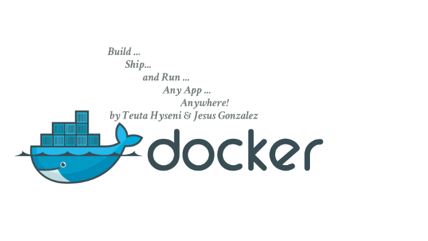
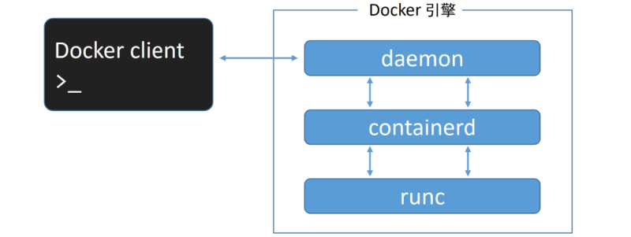
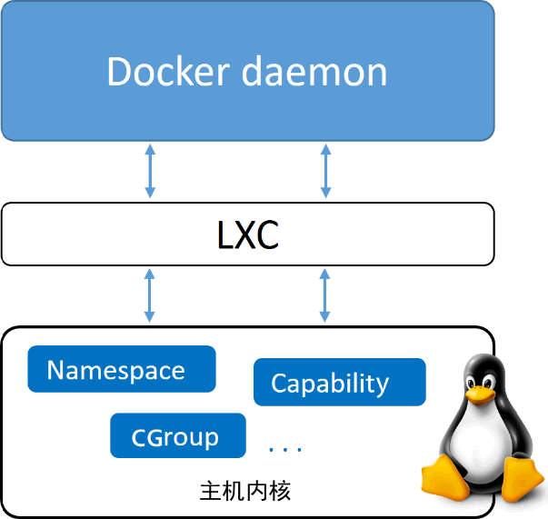
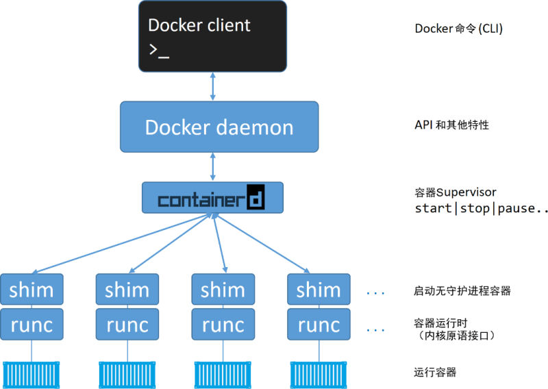
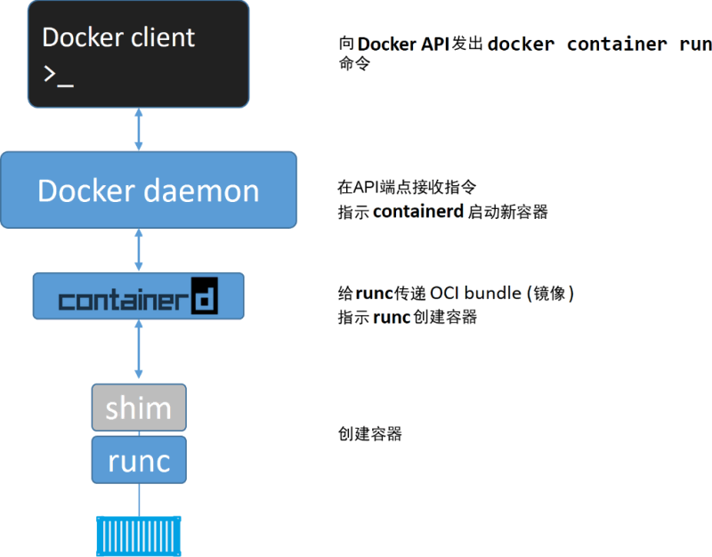

# Docker的架构和工作原理

通过下图可以得知，`Docker` 在运行时分为 `Docker 引擎（服务端守护进程）` 和 `客户端工具`，我们日常使用各种 `docker 命令`，其实就是在使用 `客户端工具` 与 `Docker 引擎` 进行交互。


## Client 客户端
Docker 是一个客户端-服务器（C/S）架构程序。Docker 客户端只需要向 Docker 服务器或者守护进程发出请求，服务器或者守护进程将完成所有工作并返回结果。Docker 提供了一个命令行工具 Docker 以及一整套 RESTful API。你可以在同一台宿主机上运行 Docker 守护进程和客户端，也可以从本地的 Docker 客户端连接到运行在另一台宿主机上的远程 Docker 守护进程。

## Host 主机(Docker 引擎)
一个物理或者虚拟的机器用于执行 Docker 守护进程和容器。

## Image 镜像
什么是 Docker 镜像？简单的理解，Docker 镜像就是一个 Linux 的文件系统（Root FileSystem），这个文件系统里面包含可以运行在 Linux 内核的程序以及相应的数据。
通过镜像启动一个容器，一个镜像就是一个可执行的包，其中包括运行应用程序所需要的所有内容：包含代码，运行时间，库，环境变量和配置文件等。
Docker 把 App 文件打包成为一个镜像，并且采用类似多次快照的存储技术，可以实现：
- 多个 App 可以共用相同的底层镜像（初始的操作系统镜像）；
- App 运行时的 IO 操作和镜像文件隔离；
- 通过挂载包含不同配置/数据文件的目录或者卷（Volume），单个 App 镜像可以用来运行无数个不同业务的容器。

## Container 容器
镜像（Image）和容器（Container）的关系，就像是面向对象程序设计中的类和实例一样，镜像是静态的定义，容器是镜像运行时的实体。容器可以被创建、启动、停止、删除、暂停等。

| Docker | 面向对象  |
| :----- | :------- |
| 镜像    | 类       |
| 容器    | 对象     |

## 镜像分层
Docker 支持通过扩展现有镜像，创建新的镜像。实际上，Docker Hub 中 99% 的镜像都是通过在 base 镜像中安装和配置需要的软件构建出来的。


从上图可以看到，新镜像是从 base 镜像一层一层叠加生成的。每安装一个软件，就在现有镜像的基础上增加一层。
镜像分层最大的一个好处就是共享资源。比如说有多个镜像都从相同的 base 镜像构建而来，那么 Docker Host 只需在磁盘上保存一份 base 镜像；同时内存中也只需加载一份 base 镜像，就可以为所有容器服务了。而且镜像的每一层都可以被共享。
如果多个容器共享一份基础镜像，当某个容器修改了基础镜像的内容，比如 /etc 下的文件，这时其他容器的 /etc 是不会被修改的，修改只会被限制在单个容器内。这就是容器 **Copy-on-Write** 特性。
　
## 可写的容器层

当容器启动时，一个新的可写层被加载到镜像的顶部。这一层通常被称作“容器层”，“容器层”之下的都叫“镜像层”。


所有对容器的改动 - 无论添加、删除、还是修改文件都只会发生在容器层中。只有**容器层是可写的，容器层下面的所有镜像层都是只读的**。
镜像层数量可能会很多，所有镜像层会联合在一起组成一个统一的文件系统。如果不同层中有一个相同路径的文件，比如 /a，上层的 /a 会覆盖下层的 /a，也就是说用户只能访问到上层中的文件 /a。在容器层中，用户看到的是一个叠加之后的文件系统。

| 文件操作 | 说明                                                         |
| -------- | ------------------------------------------------------------ |
| 添加文件 | 在容器中创建文件时，新文件被添加到容器层中。                 |
| 读取文件 | 在容器中读取某个文件时，Docker 会从上往下依次在各镜像层中查找此文件。一旦找到，立即将其复制到容器层，然后打开并读入内存。 |
| 修改文件 | 在容器中修改已存在的文件时，Docker 会从上往下依次在各镜像层中查找此文件。一旦找到，立即将其复制到容器层，然后修改之。 |
| 删除文件 | 在容器中删除文件时，Docker 也是从上往下依次在镜像层中查找此文件。找到后，会在容器层中**记录下此删除操作**。（只是记录删除操作） |

只有当需要修改时才复制一份数据，这种特性被称作 Copy-on-Write。可见，容器层保存的是镜像变化的部分，不会对镜像本身进行任何修改。

> 总结下来就是：容器层记录对镜像的修改，所有镜像层都是只读的，不会被容器修改，所以镜像可以被多个容器共享。

## Volume 数据卷
实际上我们的容器就好像是一个简易版的操作系统，只不过系统中只安装了我们的程序运行所需要的环境，前边说到我们的容器是可以删除的，那如果删除了，容器中的程序产生的需要持久化的数据怎么办呢？容器运行的时候我们可以进容器去查看，容器一旦删除就什么都没有了。
所以数据卷就是来解决这个问题的，是用来将数据持久化到我们宿主机上，与容器间实现数据共享，简单的说就是将宿主机的目录映射到容器中的目录，应用程序在容器中的目录读写数据会同步到宿主机上，这样容器产生的数据就可以持久化了，比如我们的数据库容器，就可以把数据存储到我们宿主机上的真实磁盘中。
## Registry 注册中心
Docker 用 Registry 来保存用户构建的镜像。Registry 分为公共和私有两种。Docker 公司运营公共的 Registry 叫做 Docker Hub。用户可以在 Docker Hub 注册账号，分享并保存自己的镜像。
Docker 公司提供了公共的镜像仓库 [https://hub.docker.com](https://hub.docker.com/)（Docker 称之为 Repository）提供了庞大的镜像集合供使用。
一个 Docker Registry 中可以包含多个仓库（Repository）；每个仓库可以包含多个标签（Tag）；每个标签对应一个镜像。
通常，一个仓库会包含同一个软件不同版本的镜像，而标签对应该软件的各个版本。我们可以通过 **<仓库名>:<标签>** 的格式来指定具体是这个软件哪个版本的镜像。如果不给出标签，将以 **latest** 作为默认标签。

## 总结



Docker 官网写着这样一句话：**Build and Ship any Application Anywhere**，再接合刚才我们所理解的内容，总结下来就是：**一次构建，到处运行。**
此外，Docker 公司提供了公共的镜像仓库 [https://hub.docker.com](https://hub.docker.com/)（Docker 称之为 Repository），GitHub connect，自动构建镜像，大大简化了应用分发、部署、升级流程。加上 Docker 可以非常方便的建立各种自定义的镜像文件，这些都是 Docker 成为最流行的容器技术的重要因素。

通过以上这些技术的组合，最后的结果就是：绝大部分应用，开发者都可以通过 docker build 创建镜像，通过 docker push 上传镜像，用户通过 docker pull 下载镜像，使用 docker run 运行容器应用。用户不再需要去关心如何搭建环境，如何安装，如何解决不同发行版的库冲突——而且通常不会消耗更多的硬件资源，不会明显降低性能。

## Docker引擎工作原理

Docker 引擎是用来运行和管理容器的核心软件。通常人们会简单地将其代指为 Docker 或 Docker 平台。
如果你对 VMware 略知一二，那么可以将 Docker 引擎理解为 ESXi 的角色。
基于开放容器计划（OCI）相关标准的要求，Docker 引擎采用了模块化的设计原则，其组件是可替换的。
从多个角度来看，Docker 引擎就像汽车引擎——二者都是模块化的，并且由许多可交换的部件组成。
汽车引擎由许多专用的部件协同工作，从而使汽车可以行驶，例如进气管、节气门、气缸、火花塞、排气管等。
Docker 引擎由许多专用的工具协同工作，从而可以创建和运行容器，例如 API、执行驱动、运行时、shim 进程等。
Docker 引擎由如下主要的组件构成：Docker 客户端（Docker Client）、Docker 守护进程（Docker daemon）、containerd 以及 runc。它们共同负责容器的创建和运行



Docker 首次发布时，Docker 引擎由两个核心组件构成：LXC 和 Docker daemon。
Docker daemon 是单一的二进制文件，包含诸如 Docker 客户端、Docker API、容器运行时、镜像构建等。
LXC 提供了对诸如命名空间（Namespace）和控制组（CGroup）等基础工具的操作能力，它们是基于 Linux 内核的容器虚拟化技术。
下图阐释了在 Docker 旧版本中，Docker daemon、LXC 和操作系统之间的交互关系。



对 LXC 的依赖自始至终都是个问题。
首先，LXC 是基于 Linux 的。这对于一个立志于跨平台的项目来说是个问题。
其次，如此核心的组件依赖于外部工具，这会给项目带来巨大风险，甚至影响其发展。
因此，Docker 公司开发了名为 Libcontainer 的自研工具，用于替代 LXC。
Libcontainer 的目标是成为与平台无关的工具，可基于不同内核为 Docker 上层提供必要的容器交互功能。
在 Docker 0.9 版本中，Libcontainer 取代 LXC 成为默认的执行驱动。

随着时间的推移，Docker daemon 的整体性带来了越来越多的问题。难于变更、运行越来越慢。这并非生态（或Docker公司）所期望的。
Docker 公司意识到了这些问题，开始努力着手拆解这个大而全的 Docker daemon 进程，并将其模块化。
这项任务的目标是尽可能拆解出其中的功能特性，并用小而专的工具来实现它。这些小工具可以是可替换的，也可以被第三方拿去用于构建其他工具。
这一计划遵循了在 UNIX 中得以实践并验证过的一种软件哲学：小而专的工具可以组装为大型工具。
这项拆解和重构 Docker 引擎的工作仍在进行中。不过，所有容器执行和容器运行时的代码已经完全从 daemon 中移除，并重构为小而专的工具。
目前 Docker 引擎的架构示意图如下图所示，图中有简要的描述。



当 Docker 公司正在进行 Docker daemon 进程的拆解和重构的时候，OCI 也正在着手定义两个容器相关的规范（或者说标准）。
镜像规范和容器运行时规范，两个规范均于 2017 年 7 月发布了 1.0 版。
Docker 公司参与了这些规范的制定工作，并贡献了许多的代码。
从 Docker 1.11 版本（2016 年初）开始，Docker 引擎尽可能实现了 OCI 的规范。例如，Docker daemon 不再包含任何容器运行时的代码——所有的容器运行代码在一个单独的 OCI 兼容层中实现。
默认情况下，Docker 使用 runc 来实现这一点。runc 是 OCI 容器运行时标准的参考实现。
如上图中的 runc 容器运行时层。runc 项目的目标之一就是与 OCI 规范保持一致。
目前 OCI 规范均为 1.0 版本，我们不希望它们频繁地迭代，毕竟稳定胜于一切。
除此之外，Docker 引擎中的 containerd 组件确保了 Docker 镜像能够以正确的 OCI Bundle 的格式传递给 runc。
其实，在 OCI 规范以 1.0 版本正式发布之前，Docker 引擎就已经遵循该规范实现了部分功能。

如前所述，runc 是 OCI 容器运行时规范的参考实现。Docker 公司参与了规范的制定以及 runc 的开发。
去粗取精，会发现 runc 实质上是一个轻量级的、针对 Libcontainer 进行了包装的命令行交互工具（Libcontainer 取代了早期 Docker 架构中的 LXC）。
runc 生来只有一个作用——创建容器，这一点它非常拿手，速度很快！不过它是一个 CLI 包装器，实质上就是一个独立的容器运行时工具。
因此直接下载它或基于源码编译二进制文件，即可拥有一个全功能的 runc。但它只是一个基础工具，并不提供类似 Docker 引擎所拥有的丰富功能。
有时也将 runc 所在的那一层称为“OCI 层”，如上图所示。关于 runc 的发布信息见 GitHub 中 opencontainers/runc 库的 release。

在对 Docker daemon 的功能进行拆解后，所有的容器执行逻辑被重构到一个新的名为 containerd（发音为 container-dee）的工具中。
它的主要任务是容器的生命周期管理——start | stop | pause | rm....
containerd 在 Linux 和 Windows 中以 daemon 的方式运行，从 1.11 版本之后 Docker 就开始在 Linux 上使用它。
Docker 引擎技术栈中，containerd 位于 daemon 和 runc 所在的 OCI 层之间。Kubernetes 也可以通过 cri-containerd 使用 containerd。
如前所述，containerd 最初被设计为轻量级的小型工具，仅用于容器的生命周期管理。然而，随着时间的推移，它被赋予了更多的功能，比如镜像管理。
其原因之一在于，这样便于在其他项目中使用它。比如，在 Kubernetes 中，containerd 就是一个很受欢迎的容器运行时。
然而在 Kubernetes 这样的项目中，如果 containerd 能够完成一些诸如 push 和 pull 镜像这样的操作就更好了。
因此，如今 containerd 还能够完成一些除容器生命周期管理之外的操作。不过，所有的额外功能都是模块化的、可选的，便于自行选择所需功能。
所以，Kubernetes 这样的项目在使用 containerd 时，可以仅包含所需的功能。
containerd 是由 Docker 公司开发的，并捐献给了云原生计算基金会（Cloud Native Computing Foundation, CNCF）。2017 年 12 月发布了 1.0 版本，具体的发布信息见 GitHub 中的 containerd/ containerd 库的 releases。

下面介绍一下创建新容器的过程。
常用的启动容器的方法就是使用 Docker 命令行工具。下面的docker container run命令会基于 alpine:latest 镜像启动一个新容器。

```bash
 docker container run --name ctr1 -it alpine:latest sh
```
当使用 Docker 命令行工具执行如上命令时，Docker 客户端会将其转换为合适的 API 格式，并发送到正确的 API 端点。
API 是在 daemon 中实现的。这套功能丰富、基于版本的 REST API 已经成为 Docker 的标志，并且被行业接受成为事实上的容器 API。
一旦 daemon 接收到创建新容器的命令，它就会向 containerd 发出调用。daemon 已经不再包含任何创建容器的代码了！
daemon 使用一种 CRUD 风格的 API，通过 gRPC 与 containerd 进行通信。
虽然名叫 containerd，但是它并不负责创建容器，而是指挥 runc 去做。
containerd 将 Docker 镜像转换为 OCI bundle，并让 runc 基于此创建一个新的容器。
然后，runc 与操作系统内核接口进行通信，基于所有必要的工具（Namespace、CGroup等）来创建容器。容器进程作为 runc 的子进程启动，启动完毕后，runc 将会退出。
至此，容器启动完毕。整个过程如下图所示。



该模型的显著优势
将所有的用于启动、管理容器的逻辑和代码从 daemon 中移除，意味着容器运行时与 Docker daemon 是解耦的，有时称之为“无守护进程的容器（daemonless container）”，如此，对 Docker daemon 的维护和升级工作不会影响到运行中的容器。
在旧模型中，所有容器运行时的逻辑都在 daemon 中实现，启动和停止 daemon 会导致宿主机上所有运行中的容器被杀掉。
这在生产环境中是一个大问题——想一想新版 Docker 的发布频次吧！每次 daemon 的升级都会杀掉宿主机上所有的容器，这太糟了！

shim 是实现无 daemon 的容器（用于将运行中的容器与 daemon 解耦，以便进行 daemon 升级等操作）不可或缺的工具。
前面提到，containerd 指挥 runc 来创建新容器。事实上，每次创建容器时它都会 fork 一个新的 runc 实例。
不过，一旦容器创建完毕，对应的 runc 进程就会退出。因此，即使运行上百个容器，也无须保持上百个运行中的 runc 实例。

一旦容器进程的父进程 runc 退出，相关联的 containerd-shim 进程就会成为容器的父进程。作为容器的父进程，shim 的部分职责如下。
- 保持所有 STDIN 和 STDOUT 流是开启状态，从而当 daemon 重启的时候，容器不会因为管道（pipe）的关闭而终止。
- 将容器的退出状态反馈给 daemon。

在 Linux 系统中，前面谈到的组件由单独的二进制来实现，具体包括 dockerd(Docker daemon)、docker-containerd(containerd)、docker-containerd-shim (shim) 和 docker-runc (runc)。
通过在 Docker 宿主机的 Linux 系统中执行 ps 命令可以看到以上组件的进程。当然，有些进程只有在运行容器的时候才可见。

**daemon 的作用**

当所有的执行逻辑和运行时代码都从 daemon 中剥离出来之后，问题出现了—— daemon 中还剩什么？
显然，随着越来越多的功能从 daemon 中拆解出来并被模块化，这一问题的答案也会发生变化。
不过，daemon 的主要功能包括镜像管理、镜像构建、REST API、身份验证、安全、核心网络以及编排。


