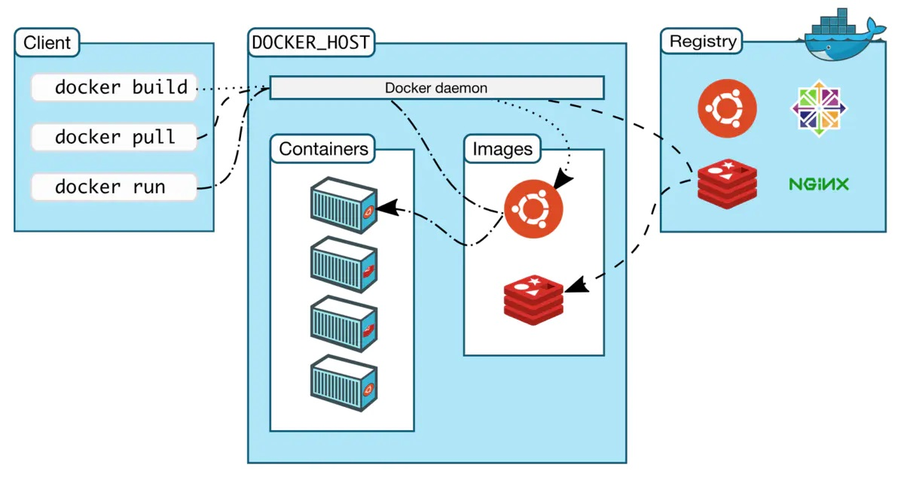

# Docker的架构和工作原理

通过下图可以得知，`Docker` 在运行时分为 `Docker 引擎（服务端守护进程）` 和 `客户端工具`，我们日常使用各种 `docker 命令`，其实就是在使用 `客户端工具` 与 `Docker 引擎` 进行交互。


## Docker 核心组件的概念

### Client 客户端
Docker 是一个客户端-服务器（C/S）架构程序。Docker 客户端只需要向 Docker 服务器或者守护进程发出请求，服务器或者守护进程将完成所有工作并返回结果。Docker 提供了一个命令行工具 Docker 以及一整套 RESTful API。你可以在同一台宿主机上运行 Docker 守护进程和客户端，也可以从本地的 Docker 客户端连接到运行在另一台宿主机上的远程 Docker 守护进程。

### Host 主机(Docker 引擎)
一个物理或者虚拟的机器用于执行 Docker 守护进程和容器。

### Image 镜像
什么是 Docker 镜像？简单的理解，Docker 镜像就是一个 Linux 的文件系统（Root FileSystem），这个文件系统里面包含可以运行在 Linux 内核的程序以及相应的数据。
通过镜像启动一个容器，一个镜像就是一个可执行的包，其中包括运行应用程序所需要的所有内容：包含代码，运行时间，库，环境变量和配置文件等。
Docker 把 App 文件打包成为一个镜像，并且采用类似多次快照的存储技术，可以实现：
- 多个 App 可以共用相同的底层镜像（初始的操作系统镜像）；
- App 运行时的 IO 操作和镜像文件隔离；
- 通过挂载包含不同配置/数据文件的目录或者卷（Volume），单个 App 镜像可以用来运行无数个不同业务的容器。

### Container 容器
镜像（Image）和容器（Container）的关系，就像是面向对象程序设计中的类和实例一样，镜像是静态的定义，容器是镜像运行时的实体。容器可以被创建、启动、停止、删除、暂停等。

| Docker | 面向对象  |
| :----- | :------- |
| 镜像    | 类       |
| 容器    | 对象     |

### 镜像分层
Docker 支持通过扩展现有镜像，创建新的镜像。实际上，Docker Hub 中 99% 的镜像都是通过在 base 镜像中安装和配置需要的软件构建出来的。


从上图可以看到，新镜像是从 base 镜像一层一层叠加生成的。每安装一个软件，就在现有镜像的基础上增加一层。
镜像分层最大的一个好处就是共享资源。比如说有多个镜像都从相同的 base 镜像构建而来，那么 Docker Host 只需在磁盘上保存一份 base 镜像；同时内存中也只需加载一份 base 镜像，就可以为所有容器服务了。而且镜像的每一层都可以被共享。
如果多个容器共享一份基础镜像，当某个容器修改了基础镜像的内容，比如 /etc 下的文件，这时其他容器的 /etc 是不会被修改的，修改只会被限制在单个容器内。这就是容器 **Copy-on-Write** 特性。
　

### 可写的容器层

当容器启动时，一个新的可写层被加载到镜像的顶部。这一层通常被称作“容器层”，“容器层”之下的都叫“镜像层”。


所有对容器的改动 - 无论添加、删除、还是修改文件都只会发生在容器层中。只有**容器层是可写的，容器层下面的所有镜像层都是只读的**。
镜像层数量可能会很多，所有镜像层会联合在一起组成一个统一的文件系统。如果不同层中有一个相同路径的文件，比如 /a，上层的 /a 会覆盖下层的 /a，也就是说用户只能访问到上层中的文件 /a。在容器层中，用户看到的是一个叠加之后的文件系统。

| 文件操作 | 说明                                                         |
| -------- | ------------------------------------------------------------ |
| 添加文件 | 在容器中创建文件时，新文件被添加到容器层中。                 |
| 读取文件 | 在容器中读取某个文件时，Docker 会从上往下依次在各镜像层中查找此文件。一旦找到，立即将其复制到容器层，然后打开并读入内存。 |
| 修改文件 | 在容器中修改已存在的文件时，Docker 会从上往下依次在各镜像层中查找此文件。一旦找到，立即将其复制到容器层，然后修改之。 |
| 删除文件 | 在容器中删除文件时，Docker 也是从上往下依次在镜像层中查找此文件。找到后，会在容器层中**记录下此删除操作**。（只是记录删除操作） |

只有当需要修改时才复制一份数据，这种特性被称作 Copy-on-Write。可见，容器层保存的是镜像变化的部分，不会对镜像本身进行任何修改。

> 总结下来就是：容器层记录对镜像的修改，所有镜像层都是只读的，不会被容器修改，所以镜像可以被多个容器共享。

### Volume 数据卷
实际上我们的容器就好像是一个简易版的操作系统，只不过系统中只安装了我们的程序运行所需要的环境，前边说到我们的容器是可以删除的，那如果删除了，容器中的程序产生的需要持久化的数据怎么办呢？容器运行的时候我们可以进容器去查看，容器一旦删除就什么都没有了。
所以数据卷就是来解决这个问题的，是用来将数据持久化到我们宿主机上，与容器间实现数据共享，简单的说就是将宿主机的目录映射到容器中的目录，应用程序在容器中的目录读写数据会同步到宿主机上，这样容器产生的数据就可以持久化了，比如我们的数据库容器，就可以把数据存储到我们宿主机上的真实磁盘中。

### Registry 注册中心
Docker 用 Registry 来保存用户构建的镜像。Registry 分为公共和私有两种。Docker 公司运营公共的 Registry 叫做 Docker Hub。用户可以在 Docker Hub 注册账号，分享并保存自己的镜像。
Docker 公司提供了公共的镜像仓库 [https://hub.docker.com](https://hub.docker.com/)（Docker 称之为 Repository）提供了庞大的镜像集合供使用。
一个 Docker Registry 中可以包含多个仓库（Repository）；每个仓库可以包含多个标签（Tag）；每个标签对应一个镜像。
通常，一个仓库会包含同一个软件不同版本的镜像，而标签对应该软件的各个版本。我们可以通过 **<仓库名>:<标签>** 的格式来指定具体是这个软件哪个版本的镜像。如果不给出标签，将以 **latest** 作为默认标签。


Docker 官网写着这样一句话：**Build and Ship any Application Anywhere**，再接合刚才我们所理解的内容，总结下来就是：**一次构建，到处运行。**
此外，Docker 公司提供了公共的镜像仓库 [https://hub.docker.com](https://hub.docker.com/)（Docker 称之为 Repository），GitHub connect，自动构建镜像，大大简化了应用分发、部署、升级流程。加上 Docker 可以非常方便的建立各种自定义的镜像文件，这些都是 Docker 成为最流行的容器技术的重要因素。

通过以上这些技术的组合，最后的结果就是：绝大部分应用，开发者都可以通过 docker build 创建镜像，通过 docker push 上传镜像，用户通过 docker pull 下载镜像，使用 docker run 运行容器应用。用户不再需要去关心如何搭建环境，如何安装，如何解决不同发行版的库冲突——而且通常不会消耗更多的硬件资源，不会明显降低性能。

## Docker 的组件构成
Docker 整体架构采用 C/S（客户端 / 服务器）模式，主要由客户端和服务端两大部分组成。客户端负责发送操作指令，服务端负责接收和处理指令。
客户端和服务端通信有多种方式，即可以在同一台机器上通过UNIX套接字通信，也可以通过网络连接远程通信


Docker 到底有哪些组件呢？我们可以在 Docker 安装路径下执行 ls 命令，这样可以看到以下与 Docker 有关的组件。
- containerd
- containerd-shim
- ctr
- docker
- docker-init
- docker-proxy
- dockerd
- runc

这些组件根据工作职责可以分为以下三大类。
- Docker 相关的组件：docker、dockerd、docker-init 和 docker-proxy
- containerd 相关的组件：containerd、containerd-shim 和 ctr
- 容器运行时相关的组件：runc

## Docker 相关的组件


### docker

docker 是 Docker 客户端的一个完整实现，它是一个二进制文件，对用户可见的操作形式为 docker 命令，
通过 docker 命令可以完成所有的 Docker 客户端与服务端的通信（还可以通过 REST API、SDK 等多种形式与 Docker 服务端通信）。

Docker 客户端与服务端的交互过程是：docker 组件向服务端发送请求后，服务端根据请求执行具体的动作并将结果返回给 docker，
docker 解析服务端的返回结果，并将结果通过命令行标准输出展示给用户。这样一次完整的客户端服务端请求就完成了。

### dockerd

dockerd 是 Docker服务端的后台常驻进程，用来接收客户端发送的请求，执行具体的处理任务，处理完成后将结果返回给客户端。
Docker 客户端可以通过多种方式向 dockerd 发送请求，我们常用的 Docker 客户端与 dockerd 的交互方式有三种。

- 通过 UNIX 套接字与服务端通信：配置格式为unix://socket_path，默认 dockerd 生成的 socket 文件路径为 /var/run/docker.sock，
该文件只有 root 用户或者 docker 用户组的用户才可以访问，这就是为什么 Docker 刚安装完成后只有 root 用户才能使用 docker 命令的原因。

- 通过 TCP 与服务端通信：配置格式为tcp://host:port，通过这种方式可以实现客户端远程连接服务端，但是在方便的同时也带有安全隐患，
因此在生产环境中如果你要使用 TCP 的方式与 Docker 服务端通信，推荐使用 TLS 认证，可以通过设置 Docker 的 TLS 相关参数，
来保证数据传输的安全。

- 通过文件描述符的方式与服务端通信：配置格式为：fd://这种格式一般用于 systemd 管理的系统中。

Docker 客户端和服务端的通信形式必须保持一致，否则将无法通信，只有当 dockerd 监听了 UNIX 套接字客户端才可以使用 
UNIX 套接字的方式与服务端通信，UNIX 套接字也是 Docker 默认的通信方式，如果你想要通过远程的方式访问 dockerd，
可以在 dockerd 启动的时候添加 -H 参数指定监听的 HOST 和 PORT。

### docker-init
如果你熟悉 Linux 系统，你应该知道在 Linux 系统中，1 号进程是 init 进程，是所有进程的父进程。主机上的进程出现问题时，
init 进程可以帮我们回收这些问题进程。同样的，在容器内部，当我们自己的业务进程没有回收子进程的能力时，
在执行 docker run 启动容器时可以添加 --init 参数，此时 Docker 会使用 docker-init 作为1号进程，
帮你管理容器内子进程，例如回收僵尸进程等。

```shell
docker run -it --init busybox sh
ps aux
-----------------------------------------------
PID   USER     TIME  COMMAND
    1 root      0:00 /sbin/docker-init -- sh
    6 root      0:00 sh
    7 root      0:00 ps aux
```

### docker-proxy
docker-proxy 主要是用来做端口映射的。当我们使用 docker run 命令启动容器时，如果使用了 -p 参数，
docker-proxy 组件就会把容器内相应的端口映射到主机上来，底层是依赖于 iptables 实现的。

```shell
# 使用以下命令启动一个 nginx 容器并把容器的 80 端口映射到主机的 8080 端口。
docker run --name=nginx -d -p 8080:80 nginx
#然后通过以下命令查看一下启动的容器 IP：
docker inspect --format '{{ .NetworkSettings.IPAddress }}' nginx
172.17.0.2
# 命令查看一下主机上是否有 docker-proxy 进程：
sudo ps aux |grep docker-proxy

root      9100  0.0  0.0 290772  9160 ?        Sl   07:48   0:00 /usr/bin/docker-proxy -proto tcp -host-ip 0.0.0.0 -host-port 8080 -container-ip 172.17.0.2 -container-port 80
root      9192  0.0  0.0 112784   992 pts/0    S+   07:51   0:00 grep --color=auto docker-proxy
```
可以看到当我们启动一个容器时需要端口映射时， Docker 为我们创建了一个 docker-proxy 进程，
并且通过参数把我们的容器 IP 和端口传递给 docker-proxy 进程，然后 docker-proxy 通过 iptables 实现了 nat 转发。

## containerd 相关的组件

### containerd

containerd 组件是从 Docker 1.11 版本正式从 dockerd 中剥离出来的，它的诞生完全遵循 OCI 标准，是容器标准化后的产物。
containerd 完全遵循了 OCI 标准，并且是完全社区化运营的，因此被容器界广泛采用。

containerd 不仅负责容器生命周期的管理，同时还负责一些其他的功能：
- 镜像的管理，例如容器运行前从镜像仓库拉取镜像到本地；
- 接收 dockerd 的请求，通过适当的参数调用 runc 启动容器；
- 管理存储相关资源；
- 管理网络相关资源。

containerd 包含一个后台常驻进程，默认的 socket 路径为 /run/containerd/containerd.sock，
dockerd 通过 UNIX 套接字向 containerd 发送请求，containerd 接收到请求后负责执行相关的动作并把执行结果返回给 dockerd。
如果你不想使用 dockerd，也可以直接使用 containerd 来管理容器，由于 containerd 更加简单和轻量，
生产环境中越来越多的人开始直接使用 containerd 来管理容器。

### containerd-shim

containerd-shim 的意思是垫片，类似于拧螺丝时夹在螺丝和螺母之间的垫片。containerd-shim 的主要作用是将 containerd 和真正的容器进程解耦，
使用 containerd-shim 作为容器进程的父进程，从而实现重启 containerd 不影响已经启动的容器进程。

### ctr

ctr 实际上是 containerd-ctr，它是 containerd 的客户端，主要用来开发和调试，在没有 dockerd 的环境中，
ctr 可以充当 docker 客户端的部分角色，直接向 containerd 守护进程发送操作容器的请求。

## 容器运行时组件runc

runc 是一个标准的 OCI 容器运行时的实现，它是一个命令行工具，可以直接用来创建和运行容器。

1. 第一步，准备容器运行时文件：进入 /home/centos 目录下，创建 runc 文件夹，并导入 busybox 镜像文件。
```shell

cd /home/centos
# 创建 runc 运行根目录
mkdir runc
# 导入 rootfs 镜像文件
mkdir rootfs && docker export $(docker create busybox) | tar -C rootfs -xvf -
```
2. 第二步，生成 runc config 文件。我们可以使用 runc spec 命令根据文件系统生成对应的 config.json 文件。命令如下：
```shell
runc spec

# 此时会在当前目录下生成 config.json 文件，我们可以使用 cat 命令查看一下 config.json 的内容：

cat config.json
{
	"ociVersion": "1.0.1-dev",
	"process": {
		"terminal": true,
		"user": {
			"uid": 0,
			"gid": 0
		},
		"args": [
			"sh"
		],
		"env": [
			"PATH=/usr/local/sbin:/usr/local/bin:/usr/sbin:/usr/bin:/sbin:/bin",
			"TERM=xterm"
		],
		"cwd": "/",
		"capabilities": {
			"bounding": [
				"CAP_AUDIT_WRITE",
				"CAP_KILL",
				"CAP_NET_BIND_SERVICE"
			],
			"effective": [
				"CAP_AUDIT_WRITE",
				"CAP_KILL",
				"CAP_NET_BIND_SERVICE"
			],
			"inheritable": [
				"CAP_AUDIT_WRITE",
				"CAP_KILL",
				"CAP_NET_BIND_SERVICE"
			],
			"permitted": [
				"CAP_AUDIT_WRITE",
				"CAP_KILL",
				"CAP_NET_BIND_SERVICE"
			],
			"ambient": [
				"CAP_AUDIT_WRITE",
				"CAP_KILL",
				"CAP_NET_BIND_SERVICE"
			]
		},
		"rlimits": [
			{
				"type": "RLIMIT_NOFILE",
				"hard": 1024,
				"soft": 1024
			}
		],
		"noNewPrivileges": true
	},
	"root": {
		"path": "rootfs",
		"readonly": true
	},
	"hostname": "runc",
	"mounts": [
		{
			"destination": "/proc",
			"type": "proc",
			"source": "proc"
		},
		{
			"destination": "/dev",
			"type": "tmpfs",
			"source": "tmpfs",
			"options": [
				"nosuid",
				"strictatime",
				"mode=755",
				"size=65536k"
			]
		},
		{
			"destination": "/dev/pts",
			"type": "devpts",
			"source": "devpts",
			"options": [
				"nosuid",
				"noexec",
				"newinstance",
				"ptmxmode=0666",
				"mode=0620",
				"gid=5"
			]
		},
		{
			"destination": "/dev/shm",
			"type": "tmpfs",
			"source": "shm",
			"options": [
				"nosuid",
				"noexec",
				"nodev",
				"mode=1777",
				"size=65536k"
			]
		},
		{
			"destination": "/dev/mqueue",
			"type": "mqueue",
			"source": "mqueue",
			"options": [
				"nosuid",
				"noexec",
				"nodev"
			]
		},
		{
			"destination": "/sys",
			"type": "sysfs",
			"source": "sysfs",
			"options": [
				"nosuid",
				"noexec",
				"nodev",
				"ro"
			]
		},
		{
			"destination": "/sys/fs/cgroup",
			"type": "cgroup",
			"source": "cgroup",
			"options": [
				"nosuid",
				"noexec",
				"nodev",
				"relatime",
				"ro"
			]
		}
	],
	"linux": {
		"resources": {
			"devices": [
				{
					"allow": false,
					"access": "rwm"
				}
			]
		},
		"namespaces": [
			{
				"type": "pid"
			},
			{
				"type": "network"
			},
			{
				"type": "ipc"
			},
			{
				"type": "uts"
			},
			{
				"type": "mount"
			}
		],
		"maskedPaths": [
			"/proc/acpi",
			"/proc/asound",
			"/proc/kcore",
			"/proc/keys",
			"/proc/latency_stats",
			"/proc/timer_list",
			"/proc/timer_stats",
			"/proc/sched_debug",
			"/sys/firmware",
			"/proc/scsi"
		],
		"readonlyPaths": [
			"/proc/bus",
			"/proc/fs",
			"/proc/irq",
			"/proc/sys",
			"/proc/sysrq-trigger"
		]
	}
}
```
3.# config.json 文件定义了 runc 启动容器时的一些配置，如根目录的路径，文件挂载路径等配置。
使用 runc 启动容器。我们可以使用 runc run 命令直接启动 busybox 容器。
```shell
runc run busybox
```

此时，我们已经创建并启动了一个 busybox 容器。我们新打开一个命令行窗口，可以使用 run list 命令看到刚才启动的容器。
通过上面的输出，我们可以看到，当前已经有一个 busybox 容器处于运行状态。
总体来说，Docker 的组件虽然很多，但每个组件都有自己清晰的工作职责，Docker 相关的组件负责发送和接受 Docker 请求，
contianerd 相关的组件负责管理容器的生命周期，而 runc 负责真正意义上创建和启动容器。这些组件相互配合，才使得 Docker 顺利完成了容器的管理工作。