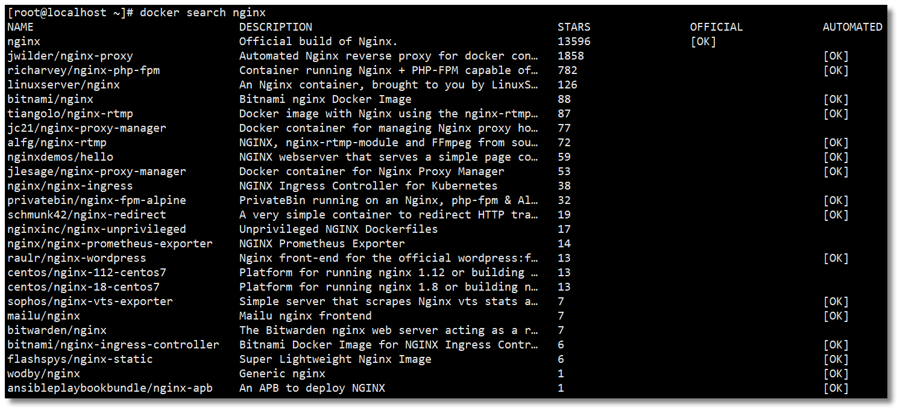
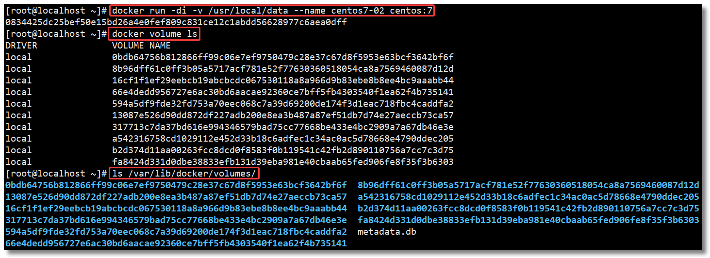
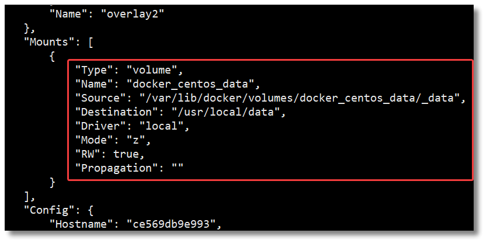

# Docker命令和容器命令集合

本文列出了 Docker 使用过程中最常用的镜像命令和容器命令，以及教大家如何操作容器数据卷，实现容器数据的备份。
大家就可以学习 Docker 的镜像构建、备份恢复迁移、镜像仓库、网络、集群等等更多的内容。

## 镜像相关命令

官方文档：https://docs.docker.com/reference/

### Docker的启动与停止

```bash
# 启动 docker
sudo systemctl start docker
# 停止 docker
sudo systemctl stop docker
# 重启 docker
sudo systemctl restart docker
# 设置开机启动
sudo systemctl enable docker
# 查看 docker 状态
sudo systemctl status docker
# 查看 docker 内容器的运行状态
sudo docker stats
# 查看 docker 概要信息
sudo docker info
# 查看 docker 帮助文档
sudo docker --help
```

### 查看镜像

```bash
[root@localhost ~]# docker images
REPOSITORY          TAG                 IMAGE ID            CREATED             SIZE
hello-world         latest              bf756fb1ae65        7 months ago        13.3kB
```

- `REPOSITORY`：镜像在仓库中的名称，本文中以后都简称镜像名称
- `TAG`：镜像标签
- `IMAGE ID`：镜像 ID
- `CREATED`：镜像的创建日期（不是获取该镜像的日期）
- `SIZE`：镜像大小

这些镜像都是存储在 Docker 宿主机的 `/var/lib/docker` 目录下。

### 搜索镜像

如果你需要从网络中查找需要的镜像，可以通过以下命令搜索。

```bash
docker search 镜像名称
```



- `NAME`：镜像名称
- `DESCRIPTION`：镜像描述
- `STARS`：用户评价，反应一个镜像的受欢迎程度
- `OFFICIAL`：是否为官方构建
- `AUTOMATED`：自动构建，表示该镜像由 Docker Hub 自动构建流程创建的。

### 拉取镜像

拉取镜像就是从中央仓库下载镜像到本地。

```bash
docker pull 镜像名称
```
假如我要拉取 centos 镜像到本地，如果不声明 tag 镜像标签信息则默认拉取 latest 版本，也可以通过：https://hub.docker.com/ 搜索该镜像，查看支持的 tag 信息。


通过查看 tag 信息，如果我们要下载 centos7 的镜像。

```bash
docker pull centos:7
```

### 删除镜像

按镜像 ID 删除镜像。

```bash
# 删除单个镜像
docker rmi 镜像ID
# 删除多个镜像
docker rmi 镜像ID 镜像ID 镜像ID
```

`docker images -q` 可以查询到所有镜像的 ID，通过组合命令可以实现删除所有镜像的操作。

```bash
docker rmi `docker images -q`
```
> 注意：如果通过某个镜像创建了容器，则该镜像无法删除。解决办法：先删除镜像中的容器，再删除该镜像。

----------------------------------------------------------------------------------------------------------

## 容器相关命令

### 查看容器

查看正在运行的容器。

```bash
[root@localhost ~]# docker ps
CONTAINER ID        IMAGE        COMMAND        CREATED        STATUS        PORTS        NAMES
```

- `CONTAINER ID`：容器 ID
- `IMAGE`：所属镜像
- `COMMAND`：
- `CREATED`：创建时间
- `STATUS`：容器状态
- `PORTS`：端口
- `NAMES`：容器名称

查看停止的容器。

```bash
docker ps -f status=exited
```
查看所有容器（包括运行和停止）。

```bash
docker ps -a
```
查看最后一次运行的容器。

```bash
docker ps -l
```
列出最近创建的 n 个容器。

```shell
docker ps -n 5
```

### 创建与启动容器

```bash
docker run [OPTIONS] IMAGE [COMMAND] [ARG...]
```
- `-i`：表示运行容器；
- `-t`：表示容器启动后会进入其命令行。加入这两个参数后，容器创建就能登录进去。即分配一个伪终端；
- `--name`：为创建的容器命名；
- `-v`：表示目录映射关系（前者是宿主机目录，后者是映射到宿主机上的目录），可以使用多个 -v 做多个目录或文件映射。注意：最好做目录映射，在宿主机上做修改，然后共享到容器上；
- `-d`：在 run 后面加上 -d 参数，则会创建一个守护式容器在后台运行（这样创建容器后不会自动登录容器，如果只加 -i -t 两个参数，创建容器后就会自动进容器里）；
- `-p`：表示端口映射，前者是宿主机端口，后者是容器内的映射端口。可以使用多个 -p 做多个端口映射。
- `-P`：随机使用宿主机的可用端口与容器内暴露的端口映射。

#### 创建并进入容器

下面这行命令的意思就是通过镜像 AA 创建一个容器 BB，运行容器并进入容器的 `/bin/bash`。

```bash
docker run -it --name 容器名称 镜像名称:标签 /bin/bash
```
注意：Docker 容器运行必须有一个前台进程， 如果没有前台进程执行，容器认为是空闲状态，就会自动退出。

**退出当前容器**

```bash
exit
```

#### 守护式方式创建容器

```bash
docker run -di --name 容器名称 镜像名称:标签
```

**登录守护式容器方式**

```bash
docker exec -it 容器名称|容器ID /bin/bash
```

### 停止与启动容器

```bash
# 停止容器
docker stop 容器名称|容器ID
# 启动容器
docker start 容器名称|容器ID
```

### 文件拷贝

如果我们需要将文件拷贝到容器内可以使用 cp 命令。
```bash
docker cp 需要拷贝的文件或目录 容器名称:容器目录
```
也可以将文件从容器内拷贝出来。

```bash
docker cp 容器名称:容器目录 需要拷贝的文件或目录
```

### 目录挂载（容器数据卷操作）

我们可以在创建容器的时候，将宿主机的目录与容器内的目录进行映射，这样我们就可以通过修改宿主机某个目录的文件从而去影响容器，而且这个操作是双向绑定的，也就是说容器内的操作也会影响到宿主机，实现备份功能。
但是容器被删除的时候，宿主机的内容并不会被删除。如果多个容器挂载同一个目录，其中一个容器被删除，其他容器的内容也不会受到影响。
容器与宿主机之间的数据卷属于引用的关系，数据卷是从外界挂载到容器内部中的，所以可以脱离容器的生命周期而独立存在，正是由于数据卷的生命周期并不等同于容器的生命周期，在容器退出或者删除以后，数据卷仍然不会受到影响，数据卷的生命周期会一直持续到没有容器使用它为止。
创建容器添加 `-v` 参数，格式为`宿主机目录:容器目录`，例如：

```shell
docker run -di -v /mydata/docker_centos/data:/usr/local/data --name centos7-01 centos:7
# 多目录挂载
docker run -di -v /宿主机目录:/容器目录 -v /宿主机目录2:/容器目录2 镜像名
```

目录挂载操作可能会出现权限不足的提示。这是因为 CentOS7 中的安全模块 SELinux 把权限禁掉了，在 docker run 时通过 `--privileged=true` 给该容器加权限来解决挂载的目录没有权限的问题。

#### 匿名挂载

匿名挂载只需要写容器目录即可，容器外对应的目录会在 `/var/lib/docker/volumes` 中生成。
```shell
# 匿名挂载
docker run -di -v /usr/local/data --name centos7-02 centos:7
# 查看 volume 数据卷信息
docker volume ls
```


#### 具名挂载

具名挂载就是给数据卷起了个名字，容器外对应的目录会在 `/var/lib/docker/volume` 中生成。

```shell
# 匿名挂载
docker run -di -v docker_centos_data:/usr/local/data --name centos7-03 centos:7
# 查看 volume 数据卷信息
docker volume ls
```


#### 指定目录挂载

一开始给大家讲解的挂载方式就属于指定目录挂载，这种方式的挂载不会在 `/var/lib/docker/volume` 目录生成内容。

```shell
docker run -di -v /mydata/docker_centos/data:/usr/local/data --name centos7-01 centos:7
# 多目录挂载
docker run -di -v /宿主机目录:/容器目录 -v /宿主机目录2:/容器目录2 镜像名
```

#### 查看目录挂载关系

通过 `docker volume inspect 数据卷名称` 可以查看该数据卷对应宿主机的目录地址。

```shell
[root@localhost ~]# docker volume inspect docker_centos_data
[
    {
        "CreatedAt": "2020-08-13T20:19:51+08:00",
        "Driver": "local",
        "Labels": null,
        "Mountpoint": "/var/lib/docker/volumes/docker_centos_data/_data",
        "Name": "docker_centos_data",
        "Options": null,
        "Scope": "local"
    }
]

```
通过 `docker inspect 容器ID或名称` ，在返回的 JSON 节点中找到 `Mounts`，可以查看详细的数据挂载信息。


　
#### 只读/读写

```shell
# 只读。只能通过修改宿主机内容实现对容器的数据管理。
docker run -it -v /宿主机目录:/容器目录:ro 镜像名
# 读写，默认。宿主机和容器可以双向操作数据。
docker run -it -v /宿主机目录:/容器目录:rw 镜像名
```

#### volumes-from（继承）

```shell
# 容器 centos7-01 指定目录挂载
docker run -di -v /mydata/docker_centos/data:/usr/local/data --name centos7-01 centos:7
# 容器 centos7-04 和 centos7-05 相当于继承 centos7-01 容器的挂载目录
docker run -di --volumes-from centos7-01:ro --name centos7-04 centos:7
docker run -di --volumes-from centos7-01:rw --name centos7-05 centos:7
```

### 查看容器 IP 地址

我们可以通过以下命令查看容器的元信息。

```shell
docker inspect 容器名称|容器ID
```

也可以直接执行下面的命令直接输出 IP 地址。

```shell
docker inspect --format='{{.NetworkSettings.IPAddress}}' 容器名称|容器ID
```

### 删除容器

```shell
# 删除指定容器
docker rm 容器名称|容器ID
# 删除多个容器
docker rm 容器名称|容器ID 容器名称|容器ID
```


