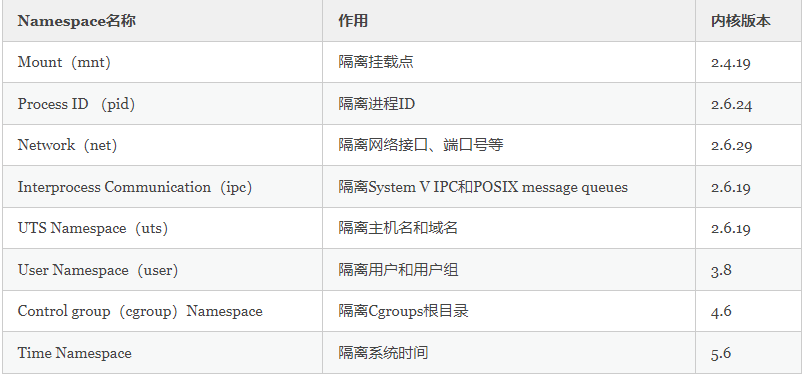

# Docker 的Namespace原理

**资源隔离：为什么构建容器需要Namespace？**

Namespace是Linux内核的一项功能，该功能对内核资源进行分区，以使一组进程看到一组资源，而另一组进程看到另一组资源。
Namespace的工作方式通过为一组资源和进程设置相同的Namespace而起作用，但是这些Namespace引用了不同的资源。
资源可能存在于多个Namespace中。这些资源可以是进程ID、主机名、用户ID、文件名、与网络访问相关的名称和进程间通信。

## Mount Namespace

隔离不同的进程或进程组看到的挂载点，实现容器内只能看到自己的挂载信息，在容器内的挂载操作不会影响主机的挂载目录。

## PID Namespace

PID Namespace 的作用是用来隔离进程的，例如一个进程在主机上的PID为122，使用PID Namespace可以实现该进程在容器内看到的PID为1

## UTS Namespace

UTS Namespace主要是用来隔离主机名的，它允许每个UTS Namespace拥有一个独立主机名。

## IPC Namespace

IPC Namespace 主要是用来隔离进程间通信的，PID Namespace和IPC Namespace 一起使用可以实现同一IPC Namespace 内的进程彼此可以通信，
不同IPC Namespace 的进程却不能通信

## User Namespace

User Namespace 主要是用来隔离用户和用户组的，使用 User Namespace 可以实现进程在容器内拥有 root 权限，而在主机上却只是普通用户

## Net Namespace

Net Namespace 用来隔离网络设备、IP 地址和端口等信息，Net Namespace 可以让每个进程拥有自己独立的 IP 地址，端口和网卡信息
例如主机 IP 地址为 172.16.4.1，容器内可以是指独立的 IP 地址为192.168.1.1

## 为什么Docker需要Namespace？

Linux内核从 2002 年 2.4.19 版本开始加入了 Mount Namespace
内核 3.8 版本加入了 User Namespace 为容器提供了足够的支持功能
当一个Docker 新建一个容器时会创建这六种 Namespace，然后将容器中的进程加入这些 Namespace之中。
Namespace 是Linux内核的一个特性，可以实现在同一主机系统中对进程 ID、主机名、用户 ID、文件名、网络和进程间通信等资源的隔离
