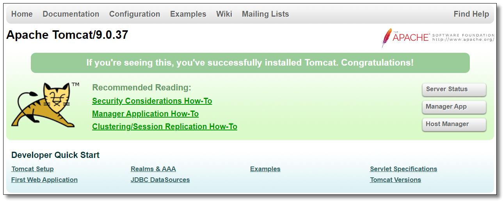

　　我们可以通过公共仓库拉取镜像使用，但是，有些时候公共仓库拉取的镜像并不符合我们的需求。尽管已经从繁琐的部署工作中解放出来，但是实际开发时，我们可能希望镜像包含整个项目的完整环境，在其他机器上拉取打包完整的镜像，直接运行即可。

　　Docker 支持自己构建镜像，还支持将自己构建的镜像上传至公共仓库，镜像构建可以通过以下两种方式来实现：

- `docker commit`：从容器创建一个新的镜像；
- `docker build`：配合 Dockerfile 文件创建镜像。

　　

　　下面我们先通过 `docker commit` 来实现镜像的构建。

　　目标：接下来我们通过基础镜像 `centos:7`，在该镜像中安装 jdk 和 tomcat 以后将其制作为一个新的镜像 `mycentos:7`。

　　

## 创建容器

　　

```shell
# 拉取镜像
docker pull centos:7
# 创建容器
docker run -di --name centos7 centos:7
```

　　

## 拷贝资源

　　

```shell
# 将宿主机的 jdk 和 tomcat 拷贝至容器
docker cp jdk-11.0.6_linux-x64_bin.tar.gz centos7:/root
docker cp apache-tomcat-9.0.37.tar.gz centos7:/root
```

　　

## 安装资源

　　

```shell
# 进入容器
docker exec -it centos7 /bin/bash
----------------------以下操作都在容器内部执行----------------------
# 切换至 /root 目录
cd root/
# 创建 java 和 tomcat 目录
mkdir -p /usr/local/java
mkdir -p /usr/local/tomcat
# 将 jdk 和 tomcat 解压至容器 /usr/local/java 和 /usr/local/tomcat 目录中
tar -zxvf jdk-11.0.6_linux-x64_bin.tar.gz -C /usr/local/java/
tar -zxvf apache-tomcat-9.0.37.tar.gz -C /usr/local/tomcat/
# 配置 jdk 环境变量
vi /etc/profile
# 在环境变量文件中添加以下内容
export JAVA_HOME=/usr/local/java/jdk-11.0.6/
export PATH=$PATH:$JAVA_HOME/bin
# 重新加载环境变量文件
source /etc/profile
# 测试环境变量是否配置成功
[root@f7787f6fcbb6 ~]# java -version
java version "11.0.6" 2020-01-14 LTS
Java(TM) SE Runtime Environment 18.9 (build 11.0.6+8-LTS)
Java HotSpot(TM) 64-Bit Server VM 18.9 (build 11.0.6+8-LTS, mixed mode)
# 删除容器内 jdk 和 tomcat
rm jdk-11.0.6_linux-x64_bin.tar.gz apache-tomcat-9.0.37.tar.gz -rf
```

　　

## 构建镜像

　　

```shell
docker commit [OPTIONS] CONTAINER [REPOSITORY[:TAG]]
docker commit -a="xxxx" -m="jdk11 and tomcat9" centos7 mycentos:7
```

- `-a`：提交的镜像作者；
- `-c`：使用 Dockerfile 指令来创建镜像；
- `-m`：提交时的说明文字；
- `-p`：在 commit 时，将容器暂停。


　　

## 使用构建的镜像创建容器

```shell
# 创建容器
docker run -di --name mycentos7 -p 8080:8080 mycentos:7
# 进入容器
docker exec -it mycentos7 /bin/bash
# 重新加载配置文件
source /etc/profile
# 测试 java 环境变量
[root@dcae87df010b /]# java -version
java version "11.0.6" 2020-01-14 LTS
Java(TM) SE Runtime Environment 18.9 (build 11.0.6+8-LTS)
Java HotSpot(TM) 64-Bit Server VM 18.9 (build 11.0.6+8-LTS, mixed mode)
# 启动 tomcat
/usr/local/apache-tomcat-9.0.37/bin/startup.sh
# 访问 http://192.168.10.10:8080/ 看到页面说明环境 OK!
```



　　基于 `docker commit` 的方式构建镜像大家已经学会了，接下来该学习如何使用 `docker build` 并配合 `Dockerfile` 文件构建镜像。再学习一下 Docker 镜像的备份恢复迁移就更好了。

