# Docker的常见应用部署

本文教大家如何将常见的应用使用 Docker 进行部署，巩固大家 Docker 命令的学习，下文教大家如何构建属于我们自己的 Docker 镜像。

## Tomcat

拉取镜像。

```shell
docker pull tomcat
```

创建容器。

```shell
docker run -di --name tomcat -p 8080:8080  --privileged=true tomcat
```

进入容器。

```shell
docker exec -it tomcat /bin/bash
```

查看 `webapps` 目录下是否有 `ROOT` 项目，我们熟悉的 Tomcat 猫页面一般就在这个项目中。

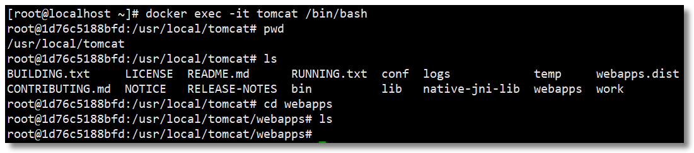

如上图所示，该目录下空空如也，其实 Tomcat 在比较新的版本中将默认的 `ROOT` 项目放在了 `webapps.dist` 中，如果你真想访问 http://192.168.10.10:8080/ 看到 Tomcat 猫，将其复制至 `webapps` 即可。

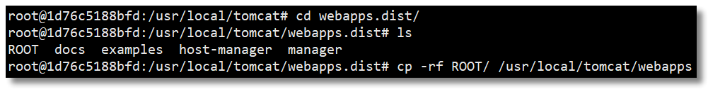

访问：http://192.168.10.10:8080/ 即可看到熟悉的面孔。

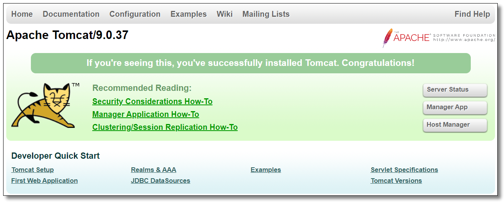

## Nginx

拉取镜像。

```shell
docker pull nginx
```

创建 Nginx 容器。

```shell
docker run -di --name nginx -p 80:80  --privileged=true nginx
```

将容器内的配置文件拷贝到指定目录（请先提前创建好目录）。

```shell
# 创建目录
mkdir -p /mydata/docker_nginx
# 将容器内的配置文件拷贝到指定目录
docker cp nginx:/etc/nginx /mydata/docker_nginx/
```

重命名宿主机 `/mydata/docker_nginx/nginx` 为 `/mydata/docker_nginx/conf`

```shell
mv /mydata/docker_nginx/nginx/ /mydata/docker_nginx/conf
```

终止并删除容器（目录挂载操作只能在创建容器时设置）。

```shell
docker stop nginx
docker rm nginx
```

创建 Nginx 容器，并将容器中的 `/etc/nginx` 目录和宿主机的 `/mydata/docker_nginx/conf` 目录进行挂载。

```shell
docker run -di --name nginx -p 80:80 -v /mydata/docker_nginx/conf:/etc/nginx --privileged=true nginx
```

访问宿主机：http://192.168.10.10:80/ 结果如下：

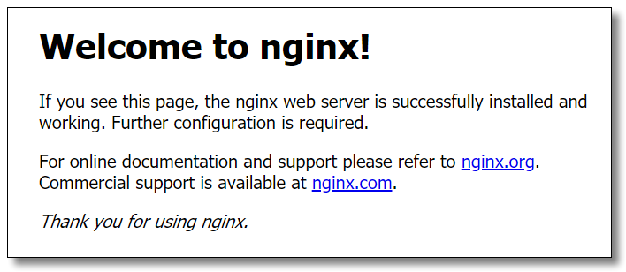
　　
## MySQL

拉取镜像。

```shell
docker pull mysql:8.0.21
```

创建容器。

```shell
docker run -di --name mysql8 -p 3306:3306 -v /mydata/docker_mysql/conf:/etc/mysql/conf.d -v /mydata/docker_mysql/data:/var/lib/mysql -e MYSQL_ROOT_PASSWORD=1234  --privileged=true mysql:8.0.21
```

- `-p`：代表端口映射，格式为 宿主机映射端口:容器运行端口。
- `-e`：代表添加环境变量 `MYSQL_ROOT_PASSWORD` 是 root 用户的登陆密码。

连接容器中的 MySQL 时，只需要连接宿主机的 IP + 指定的映射端口即可。

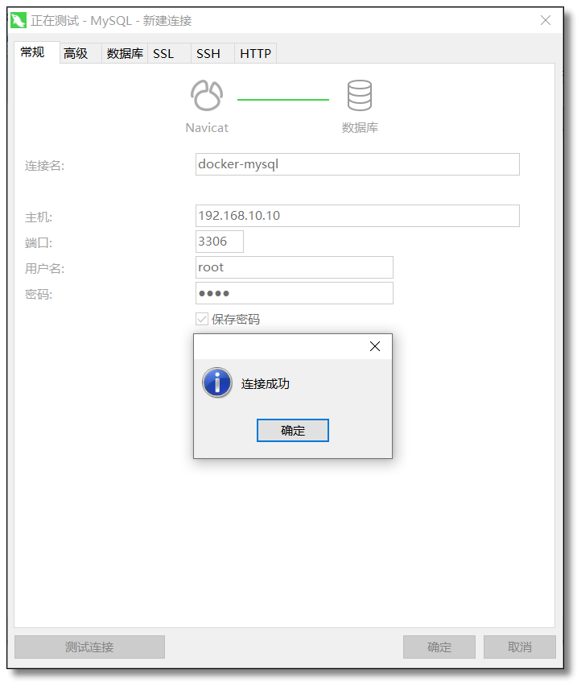

也可以进入容器并使用 MySQL 命令打开客户端。

```shell
# 进入容器
docker exec -it mysql8 /bin/bash
# 使用 MySQL 命令打开客户端
mysql -uroot -p1234 --default-character-set=utf8
```

## Redis

拉取镜像。

```shell
docker pull redis
```

创建容器。

```shell
docker run -di --name redis -p 6379:6379 --privileged=true redis
```

连接容器中的 Redis 时，只需要连接宿主机的 IP + 指定的映射端口即可。

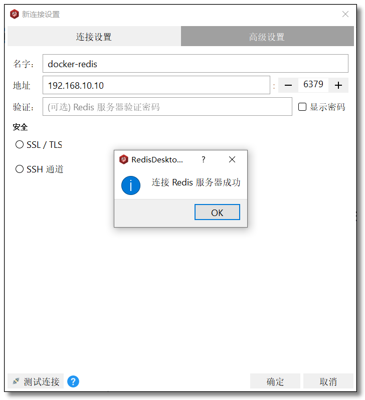
　　
## MongoDB

拉取镜像。

```shell
docker pull mongo
```

创建容器。

```shell
docker run -di --name mongo -p 27017:27017 --privileged=true mongo
```

连接容器中的 MongoDB 时，只需要连接宿主机的 IP + 指定的映射端口即可。

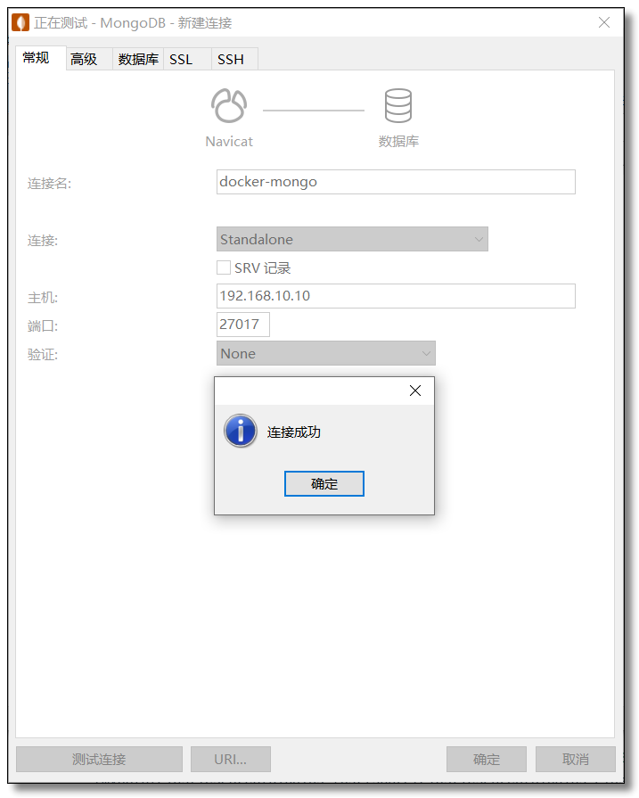
　
## Elasticsearch

拉取镜像。

```shell
docker pull elasticsearch:7.8.1
```

创建容器，为了方便演示，修改 ES 启动占用内存大小。

```shell
docker run -e ES_JAVA_OPTS="-Xms256m -Xmx512m" -e "discovery.type=single-node" -di --name es -p 9200:9200 -p 9300:9300 -p 5601:5601 -v /mydata/docker_es/plugins:/usr/share/elasticsearch/plugins --privileged=true elasticsearch:7.8.1
```

安装中文分词器。

```shell
# 进入容器
docker exec -it es /bin/bash
# 安装中文分词器
elasticsearch-plugin install https://github.com/medcl/elasticsearch-analysis-ik/releases/download/v7.8.1/elasticsearch-analysis-ik-7.8.1.zip
# 重启 es
docker restart es

```

访问：http://192.168.10.10:9200/ 结果如下：

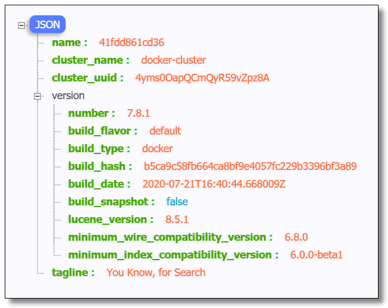
　　
### 安装 head 插件

拉取镜像。

```shell
docker pull mobz/elasticsearch-head:5
```

创建容器。

```shell
docker run -di --name es-head -p 9100:9100 --privileged=true mobz/elasticsearch-head:5
```

在浏览器中打开 elasticsearch-head 页面，填入 Elasticsearch 地址。

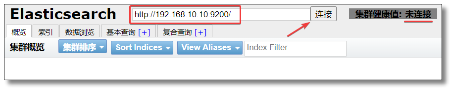

这里会出现跨域拒绝访问的问题，进入 elasticsearch 容器内部，修改配置文件 `elasticsearch.yml`。

```shell
# 进入容器
docker exec -it 容器ID或名称 /bin/bash
# 修改配置文件
vi config/elasticsearch.yml
```

在 `elasticsearch.yml` 中添加如下内容。

```shell
# 跨域请求配置（为了让类似 head 的第三方插件可以请求 es）
http.cors.enabled: true
http.cors.allow-origin: "*"
```

重启容器。

```shell
docker restart es
```

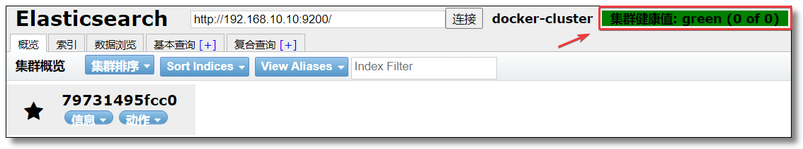
　　
## Solr

拉取镜像。

```shell
docker pull solr
```

创建容器。

```shell
docker run -di --name=solr -p 8983:8983 --privileged=true solr
```

访问：http://192.168.10.10:8983/solr/#/ 结果如下：

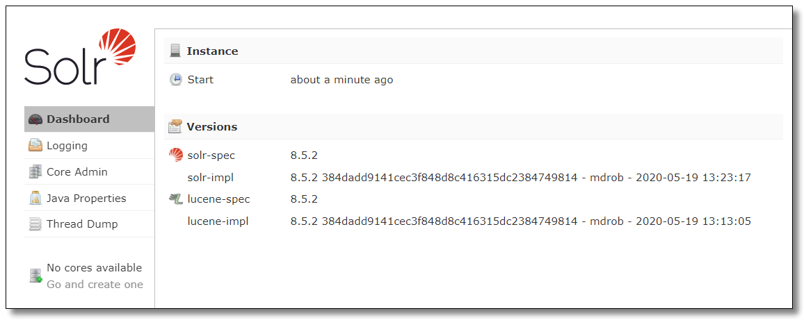
　
## RabbitMQ

拉取镜像。

```shell
docker pull rabbitmq
```

创建容器。

```shell
docker run -di --name rabbitmq -p 4369:4369 -p 5671:5671 -p 5672:5672 -p 15671:15671 -p 15672:15672 -p 25672:25672 --privileged=true rabbitmq
```

进入容器并开启管理功能。

```shell
# 进入容器
docker exec -it rabbitmq /bin/bash
# 开启 RabbitMQ 管理功能
rabbitmq-plugins enable rabbitmq_management
```

访问：http://192.168.10.10:15672/ 使用 `guest` 登录账号密码，结果如下：

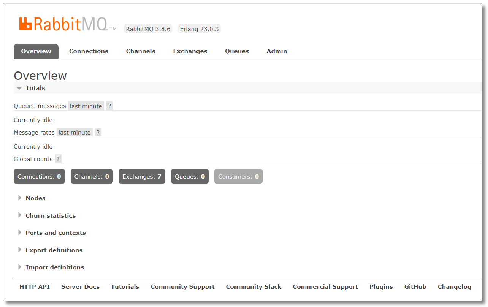
