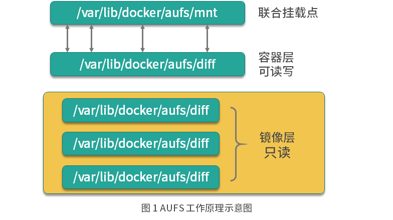

# Docker的文件存储驱动原理
Docker 主要是基于 Namespace、cgroups 和联合文件系统这三大核心技术实现的.

## 联合文件系统的基本概念
联合文件系统（Union File System，Unionfs）是一种分层的轻量级文件系统，它可以把多个目录内容联合挂载到同一目录下，
从而形成一个单一的文件系统，这种特性可以让使用者像是使用一个目录一样使用联合文件系统。

**那联合文件系统对于 Docker 是一个怎样的存在呢？**
它可以说是 Docker 镜像和容器的基础，因为它可以使 Docker 可以把镜像做成分层的结构，从而使得镜像的每一层可以被共享。
例如两个业务镜像都是基于 CentOS 7 镜像构建的，那么这两个业务镜像在物理机上只需要存储一次 CentOS 7 这个基础镜像即可，
从而节省大量存储空间。
说到这儿，你有没有发现，联合文件系统只是一个概念，真正实现联合文件系统才是关键，那如何实现呢？
其实实现方案有很多，Docker 中最常用的联合文件系统有三种：AUFS、Devicemapper 和 OverlayFS。

## 联合文件系统实现AUFS 模式原理
AUFS 是如何存储文件的？AUFS 是联合文件系统，意味着它在主机上使用多层目录存储，每一个目录在 AUFS 中都叫作分支，
而在 Docker 中则称之为层（layer），但最终呈现给用户的则是一个普通单层的文件系统，我们把多层以单一层的方式呈现出来的过程叫作联合挂载。



如图 1 所示，每一个镜像层和容器层都是 /var/lib/docker 下的一个子目录，镜像层和容器层都在 aufs/diff 目录下，
每一层的目录名称是镜像或容器的 ID 值，联合挂载点在 aufs/mnt 目录下，mnt 目录是真正的容器工作目录。


## 联合文件系统实现AUFS 模式配置
Docker 中最常用的联合文件系统里的 AUFS，为什么呢？
因为 AUFS 是 Docker 最早使用的文件系统驱动，多用于 Ubuntu 和 Debian 系统中。
在 Docker 早期，OverlayFS 和 Devicemapper 相对不够成熟，AUFS 是最早也是最稳定的文件系统驱动。
AUFS 目前并未被合并到 Linux 内核主线，因此只有 Ubuntu 和 Debian 等少数操作系统支持 AUFS。
你可以使用以下命令查看你的系统是否支持 AUFS：
```bash
grep aufs /proc/filesystems

nodev   aufs
```
执行以上命令后，如果输出结果包含aufs，则代表当前操作系统支持 AUFS。
AUFS 推荐在 Ubuntu 或 Debian 操作系统下使用，如果你想要在 CentOS 等操作系统下使用 AUFS，
需要单独安装 AUFS 模块（生产环境不推荐在 CentOS 下使用 AUFS，如果你想在 CentOS 下安装 AUFS 用于研究和测试，可以参考这个链接），
安装完成后使用上述命令输出结果中有aufs即可。 当确认完操作系统支持 AUFS 后，你就可以配置 Docker 的启动参数了。

```bash
vim /etc/docker/daemon.json
{
  "storage-driver": "aufs"
}

# 然后使用以下命令重启 Docker：
sudo systemctl restart docker
# Docker 重启以后使用docker info命令即可查看配置是否生效：
```