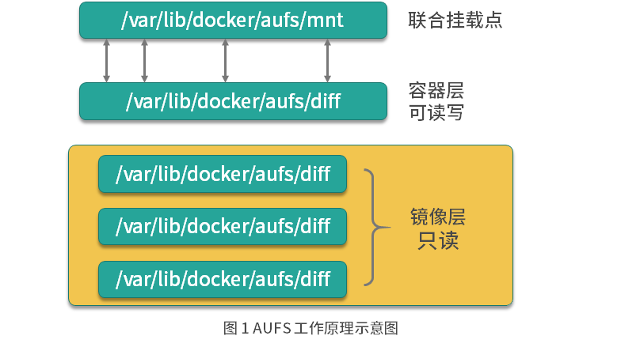
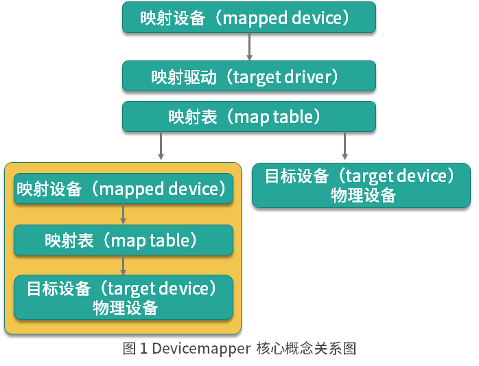
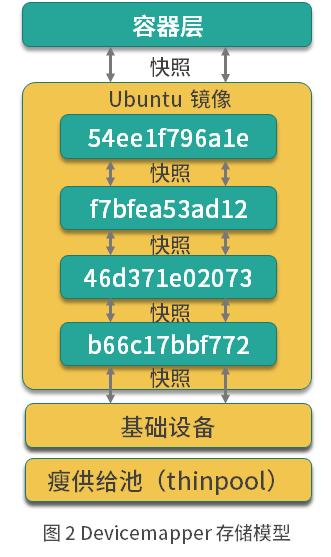

# Docker的文件存储驱动原理
Docker 主要是基于 Namespace、cgroups 和联合文件系统这三大核心技术实现的.

## 联合文件系统的基本概念
联合文件系统（Union File System，Unionfs）是一种分层的轻量级文件系统，它可以把多个目录内容联合挂载到同一目录下，
从而形成一个单一的文件系统，这种特性可以让使用者像是使用一个目录一样使用联合文件系统。

**那联合文件系统对于 Docker 是一个怎样的存在呢？**
它可以说是 Docker 镜像和容器的基础，因为它可以使 Docker 可以把镜像做成分层的结构，从而使得镜像的每一层可以被共享。
例如两个业务镜像都是基于 CentOS 7 镜像构建的，那么这两个业务镜像在物理机上只需要存储一次 CentOS 7 这个基础镜像即可，
从而节省大量存储空间。说到这儿，你有没有发现，联合文件系统只是一个概念，真正实现联合文件系统才是关键，那如何实现呢？
其实实现方案有很多，Docker 中最常用的联合文件系统有三种：AUFS、Devicemapper 和 OverlayFS。

## AUFS文件系统存储原理

### 联合文件系统实现AUFS 模式原理

AUFS 是如何存储文件的？AUFS 是联合文件系统，意味着它在主机上使用多层目录存储，每一个目录在 AUFS 中都叫作分支，
而在 Docker 中则称之为层（layer），但最终呈现给用户的则是一个普通单层的文件系统，我们把多层以单一层的方式呈现出来的过程叫作联合挂载。



如图所示，每一个镜像层和容器层都是 /var/lib/docker 下的一个子目录，镜像层和容器层都在 aufs/diff 目录下，
每一层的目录名称是镜像或容器的 ID 值，联合挂载点在 aufs/mnt 目录下，mnt 目录是真正的容器工作目录。

**当一个镜像未生成容器时，AUFS 的存储结构如下**

- diff 文件夹：存储镜像内容，每一层都存储在以镜像层 ID 命名的子文件夹中。
- layers 文件夹：存储镜像层关系的元数据，在 diif 文件夹下的每个镜像层在这里都会有一个文件，文件的内容为该层镜像的父级镜像的 ID。
- mnt 文件夹：联合挂载点目录，未生成容器时，该目录为空。

**当一个镜像已经生成容器时，AUFS 存储结构会发生如下变化**

- diff 文件夹：当容器运行时，会在 diff 目录下生成容器层。
- layers 文件夹：增加容器层相关的元数据。
- mnt 文件夹：容器的联合挂载点，这和容器中看到的文件内容一致。

### 联合文件系统实现AUFS 工作模式
AUFS 的工作过程中对文件的操作分为读取文件和修改文件。下面我们分别来看下 AUFS 对于不同的文件操作是如何工作的。

>读取文件：当我们在容器中读取文件时，可能会有以下场景。

- 文件在容器层中存在时：当文件存在于容器层时，直接从容器层读取。
- 当文件在容器层中不存在时：当容器运行时需要读取某个文件，如果容器层中不存在时，则从镜像层查找该文件，然后读取文件内容。
- 文件既存在于镜像层，又存在于容器层：当我们读取的文件既存在于镜像层，又存在于容器层时，将会从容器层读取该文件。

> 修改文件或目录 AUFS 对文件的修改采用的是写时复制的工作机制，这种工作机制可以最大程度节省存储空间。  具体的文件操作机制如下。

- 第一次修改文件：当我们第一次在容器中修改某个文件时，AUFS 会触发写时复制操作，AUFS 首先从镜像层复制文件到容器层，然后再执行对应的修改操作。
- AUFS 写时复制的操作将会复制整个文件，如果文件过大，将会大大降低文件系统的性能，因此当我们有大量文件需要被修改时，AUFS 可能会出现明显的延迟。
好在，写时复制操作只在第一次修改文件时触发，对日常使用没有太大影响。
- 删除文件或目录：当文件或目录被删除时，AUFS 并不会真正从镜像中删除它，因为镜像层是只读的，AUFS 会创建一个特殊的文件或文件夹，
这种特殊的文件或文件夹会阻止容器的访问。

### 联合文件系统实现AUFS 模式配置

Docker 中最常用的联合文件系统里的 AUFS，为什么呢？
因为 AUFS 是 Docker 最早使用的文件系统驱动，多用于 Ubuntu 和 Debian 系统中。
在 Docker 早期，OverlayFS 和 Devicemapper 相对不够成熟，AUFS 是最早也是最稳定的文件系统驱动。
AUFS 目前并未被合并到 Linux 内核主线，因此只有 Ubuntu 和 Debian 等少数操作系统支持 AUFS。
你可以使用以下命令查看你的系统是否支持 AUFS：
```bash
grep aufs /proc/filesystems

nodev   aufs
```
执行以上命令后，如果输出结果包含aufs，则代表当前操作系统支持 AUFS。
AUFS 推荐在 Ubuntu 或 Debian 操作系统下使用，如果你想要在 CentOS 等操作系统下使用 AUFS，
需要单独安装 AUFS 模块（生产环境不推荐在 CentOS 下使用 AUFS，如果你想在 CentOS 下安装 AUFS 用于研究和测试，可以参考这个链接），
安装完成后使用上述命令输出结果中有aufs即可。 当确认完操作系统支持 AUFS 后，你就可以配置 Docker 的启动参数了。

```bash
vim /etc/docker/daemon.json
{
  "storage-driver": "aufs"
}

# 然后使用以下命令重启 Docker：
sudo systemctl restart docker
# Docker 重启以后使用docker info命令即可查看配置是否生效：
```

## AUFS dock中工程实践

### 准备演示目录和文件

首先我们在 /tmp 目录下创建 aufs 目录：

```bash
# 首先我们在 /tmp 目录下创建 aufs 目录：
cd /tmp
/tmp$ mkdir aufs
# 准备挂载点目录：
/tmp$ cd aufs
/tmp/aufs$ mkdir mnt
#接下来准备容器层内容：
## 创建镜像层目录
/tmp/aufs$ mkdir container1
## 在镜像层目录下准备一个文件
/tmp/aufs$ echo Hello, Container layer! > container1/container1.txt
# 最后准备镜像层内容：
## 创建两个镜像层目录
/tmp/aufs$ mkdir image1 && mkdir image2
## 分别写入数据
/tmp/aufs$ echo Hello, Image layer1! > image1/image1.txt
/tmp/aufs$ echo Hello, Image layer2! > image2/image2.txt
# 准备好的目录和文件结构如下：
/tmp/aufs$ tree .
.
|-- container1
|   `-- container1.txt
|-- image1
|   `-- image1.txt
|-- image2
|   `-- image2.txt
`-- mnt
4 directories, 3 files
```

### 创建 AUFS 联合文件系统

使用 mount 命令可以创建 AUFS 类型的文件系统，命令如下：
```bash
/tmp/aufs$ sudo mount -t aufs -o dirs=./container1:./image2:./image1  none ./mnt

# mount 命令创建 AUFS 类型文件系统时，这里要注意，dirs 参数第一个冒号默认为读写权限，后面的目录均为只读权限，
# 与 Docker 容器使用 AUFS 的模式一致。

# 执行完上述命令后，mnt 变成了 AUFS 的联合挂载目录，我们可以使用 mount 命令查看一下已经创建的 AUFS 文件系统：
/tmp/aufs$ mount -t aufs
none on /tmp/aufs/mnt type aufs (rw,relatime,si=4174b83d649ffb7c)

# 我们每创建一个 AUFS 文件系统，AUFS 都会为我们生成一个 ID，这个 ID 在 /sys/fs/aufs/ 会创建对应的目录，
# 在这个 ID 的目录下可以查看文件挂载的权限。

tmp/aufs$ cat /sys/fs/aufs/si_4174b83d649ffb7c/*

/tmp/aufs/container1=rw

/tmp/aufs/image2=ro

/tmp/aufs/image1=ro
```
可以看到 container1 目录的权限为 rw（代表可读写），image1 和 image2 的权限为 ro（代表只读）。
为了验证 mnt 目录下可以看到 container1、image1 和 image2 目录下的所有内容，我们使用 ls 命令查看一下 mnt 目录：
```bash
/tmp/aufs$ ls -l mnt/
total 12
-rw-rw-r-- 1 ubuntu ubuntu 24 Sep  9 16:55 container1.txt
-rw-rw-r-- 1 ubuntu ubuntu 21 Sep  9 16:59 image1.txt
-rw-rw-r-- 1 ubuntu ubuntu 21 Sep  9 16:59 image2.txt
```
可以看到 mnt 目录下已经出现了我们准备的所有镜像层和容器层的文件。

### 验证 AUFS 的写时复制

AUFS 的写时复制是指在容器中，只有需要修改某个文件时，才会把文件从镜像层复制到容器层，
下面我们通过修改联合挂载目录 mnt 下的内容来验证下这个过程。

我们使用以下命令修改 mnt 目录下的 image1.txt 文件：
```bash
/tmp/aufs$ echo Hello, Image layer1 changed! > mnt/image1.txt

# 然后我们查看下 image1/image1.txt 文件内容：

/tmp/aufs$ cat image1/image1.txt
Hello, Image layer1!

# 发现“镜像层”的 image1.txt 文件并未被修改。 然后我们查看一下"容器层"对应的 image1.txt 文件内容：
/tmp/aufs$ ls -l container1/
total 8
-rw-rw-r-- 1 ubuntu ubuntu 24 Sep  9 16:55 container1.txt
-rw-rw-r-- 1 ubuntu ubuntu 29 Sep  9 17:21 image1.txt
## 查看文件内容
/tmp/aufs$ cat container1/image1.txt
Hello, Image layer1 changed!
```

发现 AUFS 在“容器层”自动创建了 image1.txt 文件，并且内容为我们刚才写入的内容。
至此，我们完成了 AUFS 写时复制的验证。我们在第一次修改镜像内某个文件时，AUFS 会复制这个文件到容器层，
然后在容器层对该文件进行修改操作，这就是 AUFS 最典型的特性写时复制。

## Devicemapper文件系统原理

AUFS 并不在 Linux 内核主干中，所以如果你的操作系统是 CentOS，就不推荐使用 AUFS 作为 Docker 的联合文件系统了。
那在 CentOS 系统中，我们怎么实现镜像和容器的分层结构呢？我们通常使用 Devicemapper 作为 Docker 的联合文件系统。

### Devicemapper模式原理

Devicemapper 是 Linux 内核提供的框架，从 Linux 内核 2.6.9 版本开始引入，Devicemapper 与 AUFS 不同，
AUFS 是一种文件系统，而Devicemapper 是一种映射块设备的技术框架。

Devicemapper 提供了一种将物理块设备映射到虚拟块设备的机制，目前 Linux 下比较流行的 LVM 
（Logical Volume Manager 是 Linux 下对磁盘分区进行管理的一种机制）和软件磁盘阵列
（将多个较小的磁盘整合成为一个较大的磁盘设备用于扩大磁盘存储和提供数据可用性）都是基于 Devicemapper 机制实现的。

**Devicemapper 的关键技术**

Devicemapper 将主要的工作部分分为用户空间和内核空间。

- 用户空间负责配置具体的设备映射策略与相关的内核空间控制逻辑，例如逻辑设备 dm-a 如何与物理设备 sda 相关联，
怎么建立逻辑设备和物理设备的映射关系等。
- 内核空间则负责用户空间配置的关联关系实现，例如当 IO 请求到达虚拟设备 dm-a 时，内核空间负责接管 IO 请求，
然后处理和过滤这些 IO 请求并转发到具体的物理设备 sda 上。

这个架构类似于 C/S （客户端/服务区）架构的工作模式，客户端负责具体的规则定义和配置下发，服务端根据客户端配置的规则来执行具体的处理任务。

Devicemapper 的工作机制主要围绕三个核心概念。
- 映射设备（mapped device）：即对外提供的逻辑设备，它是由 Devicemapper 模拟的一个虚拟设备，并不是真正存在于宿主机上的物理设备。
- 目标设备（target device）：目标设备是映射设备对应的物理设备或者物理设备的某一个逻辑分段，是真正存在于物理机上的设备。
- 映射表（map table）：映射表记录了映射设备到目标设备的映射关系，它记录了映射设备在目标设备的起始地址、范围和目标设备的类型等变量。



Devicemapper 三个核心概念之间的关系如图 1，映射设备通过映射表关联到具体的物理目标设备。
事实上，映射设备不仅可以通过映射表关联到物理目标设备，也可以关联到虚拟目标设备，然后虚拟目标设备再通过映射表关联到物理目标设备。

Devicemapper 在内核中通过很多模块化的映射驱动（target driver）插件实现了对真正 IO 请求的拦截、过滤和转发工作，
比如 Raid、软件加密、瘦供给（Thin Provisioning）等。其中瘦供给模块是 Docker 使用 Devicemapper 技术框架中非常重要的模块，
下面我们来详细了解下瘦供给（Thin Provisioning）。

### 瘦供给（Thin Provisioning）

瘦供给的意思是动态分配，这跟传统的固定分配不一样。传统的固定分配是无论我们用多少都一次性分配一个较大的空间，
这样可能导致空间浪费。而瘦供给是我们需要多少磁盘空间，存储驱动就帮我们分配多少磁盘空间。
这种分配机制就好比我们一群人围着一个大锅吃饭，负责分配食物的人每次都给你一点分量，当你感觉食物不够时再去申请食物，
而当你吃饱了就不需要再去申请食物了，从而避免了食物的浪费，节约的食物可以分配给更多需要的人。
那么，你知道 Docker 是如何使用瘦供给来做到像 AUFS 那样分层存储文件的吗？答案就是： Docker 使用了瘦供给的快照（snapshot）技术。
什么是快照（snapshot）技术？这是全球网络存储工业协会 SNIA（StorageNetworking Industry Association）对快照（Snapshot）的定义：
关于指定数据集合的一个完全可用拷贝，该拷贝包括相应数据在某个时间点（拷贝开始的时间点）的映像。
快照可以是其所表示的数据的一个副本，也可以是数据的一个复制品。

简单来说，快照是数据在某一个时间点的存储状态。快照的主要作用是对数据进行备份，当存储设备发生故障时，
可以使用已经备份的快照将数据恢复到某一个时间点，而 Docker 中的数据分层存储也是基于快照实现的。

### Devicemapper 如何数据存储
当 Docker 使用 Devicemapper 作为文件存储驱动时，Docker 将镜像和容器的文件存储在瘦供给池（thinpool）中，
并将这些内容挂载在 /var/lib/docker/devicemapper/ 目录下。

这些目录储存 Docker 的容器和镜像相关数据，目录的数据内容和功能说明如下。
- devicemapper 目录（/var/lib/docker/devicemapper/devicemapper/）：存储镜像和容器实际内容，该目录由一个或多个块设备构成。
- metadata 目录（/var/lib/docker/devicemapper/metadata/）： 包含 Devicemapper 本身配置的元数据信息, 
以 json 的形式配置，这些元数据记录了镜像层和容器层之间的关联信息。
- mnt 目录（ /var/lib/docker/devicemapper/mnt/）：是容器的联合挂载点目录，未生成容器时，该目录为空，而容器存在时，该目录下的内容跟容器中一致。

### Devicemapper 如何实现镜像分层与共享

Devicemapper 使用专用的块设备实现镜像的存储，并且像 AUFS 一样使用了写时复制的技术来保障最大程度节省存储空间，
所以 Devicemapper 的镜像分层也是依赖快照来是实现的。

Devicemapper 的每一镜像层都是其下一层的快照，最底层的镜像层是我们的瘦供给池，通过这种方式实现镜像分层有以下优点。
- 相同的镜像层，仅在磁盘上存储一次。例如，我有 10 个运行中的 busybox 容器，底层都使用了 busybox 镜像，那么 busybox 镜像只需要在磁盘上存储一次即可。
- 快照是写时复制策略的实现，也就是说，当我们需要对文件进行修改时，文件才会被复制到读写层。
- 相比对文件系统加锁的机制，Devicemapper 工作在块级别，因此可以实现同时修改和读写层中的多个块设备，比文件系统效率更高。

当我们需要读取数据时，如果数据存在底层快照中，则向底层快照查询数据并读取。当我们需要写数据时，则向瘦供给池动态申请存储空间生成读写层，
然后把数据复制到读写层进行修改。Devicemapper 默认每次申请的大小是 64K 或者 64K 的倍数，因此每次新生成的读写层的大小都是 64K 或者 64K 的倍数。



这个 Ubuntu 镜像一共有四层，每一层镜像都是下一层的快照，镜像的最底层是基础设备的快照。当容器运行时，容器是基于镜像的快照。
综上，Devicemapper 实现镜像分层的根本原理就是快照。

## Docker 中配置 Devicemapper实战

Docker 的 Devicemapper 模式有两种：第一种是 loop-lvm 模式，该模式主要用来开发和测试使用；第二种是 direct-lvm 模式，该模式推荐在生产环境中使用。

### 配置 loop-lvm 模式

```bash
# 1.使用以下命令停止已经运行的 Docker：
 sudo systemctl stop docker
# 2.vim /etc/docker/daemon.json 文件，如果该文件不存在，则创建该文件，并添加以下配置
{
  "storage-driver": "devicemapper"
}
# 3.启动 Docker：
sudo systemctl start docker
# 4.验证 Docker 的文件驱动模式：
docker info
```

### 配置 direct-lvm 模式**

```bash
# 1. 使用以下命令停止已经运行的 Docker：
sudo systemctl stop docker
# 2.vim /etc/docker/daemon.json 文件，如果该文件不存在，则创建该文件，并添加以下配置：
{
  "storage-driver": "devicemapper",
  "storage-opts": [
    "dm.directlvm_device=/dev/xdf",
    "dm.thinp_percent=95",
    "dm.thinp_metapercent=1",
    "dm.thinp_autoextend_threshold=80",
    "dm.thinp_autoextend_percent=20",
    "dm.directlvm_device_force=false"
  ]
}
# 其中 directlvm_device 指定需要用作 Docker 存储的磁盘路径，Docker 会动态为我们创建对应的存储池。
# 例如这里我想把 /dev/xdf 设备作为我的 Docker 存储盘，directlvm_device 则配置为 /dev/xdf。
# 3.启动 Docker：
sudo systemctl start docker
# 4.验证 Docker 的文件驱动模式：
docker info
```
当我们看到 Storage Driver 为 devicemapper，并且 Pool Name 为 docker-thinpool 时，这表示 Devicemapper 的 direct-lvm 模式已经配置成功。

Devicemapper 使用块设备来存储文件，运行速度会比直接操作文件系统更快，因此很长一段时间内在 Red Hat 或 CentOS 系统中，
Devicemapper 一直作为 Docker 默认的联合文件系统驱动，为 Docker 在 Red Hat 或 CentOS 稳定运行提供强有力的保障。shi实战

## OverlayFS 文件系统原理

OverlayFS 的发展分为两个阶段。2014 年，OverlayFS 第一个版本被合并到 Linux 内核 3.18 版本中，此时的 OverlayFS 在
Docker 中被称为overlay文件驱动。由于第一版的overlay文件系统存在很多弊端（例如运行一段时间后Docker 会报 "too many links problem" 的错误），
Linux 内核在 4.0 版本对overlay做了很多必要的改进，此时的 OverlayFS 被称之为overlay2。
因此，在 Docker 中 OverlayFS 文件驱动被分为了两种，一种是早期的overlay，不推荐在生产环境中使用，
另一种是更新和更稳定的overlay2，推荐在生产环境中使用。

### overlay2 工作原理

overlay2 是如何存储文件的？overlay2 和 AUFS 类似，它将所有目录称之为层（layer），overlay2 的目录是镜像和容器分层的基础，
而把这些层统一展现到同一的目录下的过程称为联合挂载（union mount）。overlay2 把目录的下一层叫作lowerdir，上一层叫作upperdir，
联合挂载后的结果叫作merged。
> overlay2 文件系统最多支持 128 个层数叠加，也就是说你的 Dockerfile 最多只能写 128 行，不过这在日常使用中足够了。

总体来说，overlay2 是这样储存文件的：overlay2将镜像层和容器层都放在单独的目录，并且有唯一 ID，每一层仅存储发生变化的文件，
最终使用联合挂载技术将容器层和镜像层的所有文件统一挂载到容器中，使得容器中看到完整的系统文件。

### overlay2 如何读取、修改文件？

overlay2 的工作过程中对文件的操作分为读取文件和修改文件。
> 读取文件

容器内进程读取文件分为以下三种情况。
- 文件在容器层中存在：当文件存在于容器层并且不存在于镜像层时，直接从容器层读取文件；
- 当文件在容器层中不存在：当容器中的进程需要读取某个文件时，如果容器层中不存在该文件，则从镜像层查找该文件，然后读取文件内容；
- 文件既存在于镜像层，又存在于容器层：当我们读取的文件既存在于镜像层，又存在于容器层时，将会从容器层读取该文件。

> 修改文件或目录

overlay2 对文件的修改采用的是写时复制的工作机制，这种工作机制可以最大程度节省存储空间。具体的文件操作机制如下。

- 第一次修改文件：当我们第一次在容器中修改某个文件时，overlay2 会触发写时复制操作，overlay2 首先从镜像层复制文件到容器层，
然后在容器层执行对应的文件修改操作。
- overlay2 写时复制的操作将会复制整个文件，如果文件过大，将会大大降低文件系统的性能，因此当我们有大量文件需要被修改时，
overlay2 可能会出现明显的延迟。好在，写时复制操作只在第一次修改文件时触发，对日常使用没有太大影响。
- 删除文件或目录：当文件或目录被删除时，overlay2 并不会真正从镜像中删除它，因为镜像层是只读的，
overlay2 会创建一个特殊的文件或目录，这种特殊的文件或目录会阻止容器的访问。

**overlay2 目前已经是 Docker 官方推荐的文件系统了，也是目前安装 Docker 时默认的文件系统，
因为 overlay2 在生产环境中不仅有着较高的性能，它的稳定性也极其突出。但是 overlay2 的使用还是有一些限制条件的，
例如要求 Docker 版本必须高于 17.06.02，内核版本必须高于 4.0 等。因此，在生产环境中，
如果你的环境满足使用 overlay2 的条件，请尽量使用 overlay2 作为 Docker 的联合文件系统。**

## OverlayFS 实战

### OverlayFS测试

overlay2虽然很好，但是它的使用是有一定条件限制的。要想使用overlay2，Docker 版本必须高于 17.06.02。
如果你的操作系统是 RHEL 或 CentOS，Linux 内核版本必须使用 3.10.0-514 或者更高版本，
其他 Linux 发行版的内核版本必须高于 4.0（例如 Ubuntu 或 Debian），你可以使用uname -a查看当前系统的内核版本。
overlay2最好搭配 xfs 文件系统使用，并且使用 xfs 作为底层文件系统时，d_type必须开启，可以使用以下命令验证 d_type 是否开启：
```bash
xfs_info /var/lib/docker | grep ftype
naming   =version 2              bsize=4096   ascii-ci=0 ftype=1
# 当输出结果中有 ftype=1 时，表示 d_type 已经开启。如果你的输出结果为 ftype=0，则需要重新格式化磁盘目录，命令如下：
sudo mkfs.xfs -f -n ftype=1 /path/to/disk

# 另外，在生产环境中，推荐挂载 /var/lib/docker 目录到单独的磁盘或者磁盘分区，这样可以避免该目录写满影响主机的文件写入，
# 并且把挂载信息写入到 /etc/fstab，防止机器重启后挂载信息丢失。

# 挂载配置中推荐开启 pquota，这样可以防止某个容器写文件溢出导致整个容器目录空间被占满。写入到 /etc/fstab 中的内容如下：
UUID /var/lib/docker xfs defaults,pquota 0 0

# 其中 UUID 为 /var/lib/docker 所在磁盘或者分区的 UUID 或者磁盘路径。 
# 如果你的操作系统无法满足上面的任何一个条件，那我推荐你使用 AUFS 或者 Devicemapper 作为你的 Docker 文件系统驱动。
# 通常情况下， overlay2 会比 AUFS 和 Devicemapper 性能更好，而且更加稳定，
# 因为 overlay2 在 inode 优化上更加高效。因此在生产环境中推荐使用 overlay2 作为 Docker 的文件驱动。
```
- 1.准备 /var/lib/docker 目录
```bash
# 使用 lsblk（Linux 查看磁盘和块设备信息命令）命令查看本机磁盘信息：
lsblk

NAME   MAJ:MIN RM  SIZE RO TYPE MOUNTPOINT
vda    253:0    0  500G  0 disk
`-vda1 253:1    0  500G  0 part /
vdb    253:16   0  500G  0 disk
`-vdb1 253:17   0    8G  0 part

# 可以看到，我的机器有两块磁盘，一块是 vda，一块是 vdb。其中 vda 已经被用来挂载系统根目录，
# 这里我想把 /var/lib/docker 挂载到 vdb1 分区上。
```

- 2.使用 mkfs 命令格式化磁盘 vdb1：
```bash
sudo mkfs.xfs -f -n ftype=1 /dev/vdb1
```

- 3.将挂载信息写入到 /etc/fstab，保证机器重启挂载目录不丢失：
```bash
sudo echo "/dev/vdb1 /var/lib/docker xfs defaults,pquota 0 0" >> /etc/fstab
```

- 4.使用 mount 命令使得挂载目录生效：
```bash
sudo mount -a
```

- 5.查看挂载信息：
```bash
lsblk

NAME   MAJ:MIN RM  SIZE RO TYPE MOUNTPOINT
vda    253:0    0  500G  0 disk
`-vda1 253:1    0  500G  0 part /
vdb    253:16   0  500G  0 disk
`-vdb1 253:17   0    8G  0 part /var/lib/docker

# 可以看到此时 /var/lib/docker 目录已经被挂载到了 vdb1 这个磁盘分区上。我们使用 xfs_info 命令验证下 d_type 是否已经成功开启：
xfs_info /var/lib/docker | grep ftype
naming   =version 2              bsize=4096   ascii-ci=0 ftype=1

# 可以看到输出结果为 ftype=1，证明 d_type 已经被成功开启。
# 准备好 /var/lib/docker 目录后，我们就可以配置 Docker 的文件驱动为 overlay2，并且启动 Docker 了。
```

### 如何在 Docker 中配置 overlay2？
当你的系统满足上面的条件后，就可以配置你的 Docker 存储驱动为 overlay2 了，具体配置步骤如下。

- 1.停止已经运行的 Docker：
```bash
sudo systemctl stop docker
```
- 2.备份 /var/lib/docker 目录：
```bash
sudo cp -au /var/lib/docker /var/lib/docker.back
```
- 3.在 /etc/docker 目录下创建 daemon.json 文件，如果该文件已经存在，则修改配置为以下内容：
```bash
{
"storage-driver": "overlay2",
"storage-opts": [
    "overlay2.size=20G",
    "overlay2.override_kernel_check=true"
    ]
}
```
其中 storage-driver 参数指定使用 overlay2 文件驱动，overlay2.size 参数表示限制每个容器根目录大小为 20G。
限制每个容器的磁盘空间大小是通过 xfs 的 pquota 特性实现，overlay2.size 可以根据不同的生产环境来设置这个值的大小。
我推荐你在生产环境中开启此参数，防止某个容器写入文件过大，导致整个 Docker 目录空间溢出。

- 4.启动 Docker

```bash
sudo systemctl start docker
```
5.检查配置是否生效：

```bash
docker info
```


