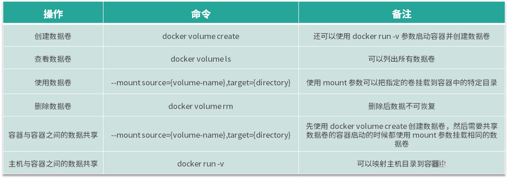

# Docker volume 原理与实现

## 为什么容器需要持久化存储
容器按照业务类型，总体可以分为两类：
- 无状态的（数据不需要被持久化）
- 有状态的（数据需要被持久化）

显然，容器更擅长无状态应用。因为未持久化数据的容器根目录的生命周期与容器的生命周期一样，
容器文件系统的本质是在镜像层上面创建的读写层，运行中的容器对任何文件的修改都存在于该读写层，
当容器被删除时，容器中的读写层也会随之消失。

虽然容器希望所有的业务都尽量保持无状态，这样容器就可以开箱即用，并且可以任意调度，
但实际业务总是有各种需要数据持久化的场景，比如 MySQL、Kafka 等有状态的业务。
因此为了解决有状态业务的需求，Docker 提出了卷（Volume）的概念。


什么是卷？卷的本质是文件或者目录，它可以绕过默认的联合文件系统，直接以文件或目录的形式存在于宿主机上。
卷的概念不仅解决了**数据持久化的问题，还解决了容器间共享数据的问题**。使用卷可以将容器内的目录或文件持久化，
当容器重启后保证数据不丢失，例如我们可以使用卷将 MySQL 的目录持久化，实现容器重启数据库数据不丢失。

## docker volume的基本原理

镜像和容器的文件系统原理： 镜像是由多层文件系统组成的，当我们想要启动一个容器时，Docker 会在镜像上层创建一个可读写层，
容器中的文件都工作在这个读写层中，当容器删除时，与容器相关的工作文件将全部丢失。

**Docker 容器的文件系统不是一个真正的文件系统，而是通过联合文件系统实现的一个伪文件系统，
而 Docker 卷则是直接利用主机的某个文件或者目录，它可以绕过联合文件系统，直接挂载主机上的文件或目录到容器中，这就是它的工作原理。**\

```bash
# 我们通过一个实例来说明卷的工作原理。首先，我们创建一个名称为 volume-data 的卷：
docker volume create volume-data
# 我们使用 ls 命令查看一下 /var/lib/docker/volumes 目录下的内容：
sudo ls -l /var/lib/docker/volumes
drwxr-xr-x. 3 root root    19 Sep  8 10:59 volume-data
# 然后再看下 volume-data 目录下有什么内容：
sudo ls -l /var/lib/docker/volumes/volume-data
total 0
drwxr-xr-x. 2 root root 6 Sep  8 10:59 _data
# 可以看到我们创建的卷出现在了 /var/lib/docker/volumes 目录下，并且 volume-data 目录下还创建了一个 _data 目录。
```
**实际上，在我们创建 Docker 卷时，Docker 会把卷的数据全部放在 /var/lib/docker/volumes 目录下，
并且在每个对应的卷的目录下创建一个 _data 目录，然后把 _data 目录绑定到容器中。因此我们在容器中挂载卷的目录下操作文件，
实际上是在操作主机上的 _data 目录。**

```bash
# 我们启动一个容器，并且绑定 volume-data 卷到容器内的 /data 目录下：
docker run -it --mount source=volume-data,target=/data busybox
# 我们进入到容器的 /data 目录，创建一个 data.log 文件:
cd data/
/data # touch data.log
# 然后我们新打开一个命令行窗口，查看一下主机上的文件内容：
sudo ls -l /var/lib/docker/volumes/volume-data/_data
total 0
-rw-r--r--. 1 root root 0 Sep  8 11:15 data.log
```
可以看到主机上的 _data 目录下也出现了 data.log 文件。这说明，在容器内操作卷挂载的目录就是直接操作主机上的 _data 目录，符合我上面的说法。

**综上，Docker 卷的实现原理是在主机的 /var/lib/docker/volumes 目录下，根据卷的名称创建相应的目录，
然后在每个卷的目录下创建 _data 目录，在容器启动时如果使用 --mount 参数，
Docker 会把主机上的目录直接映射到容器的指定目录下，实现数据持久化。**

## docker volume的实战

```bash
# 创建数据卷 
# 我们使用以下命令创建一个名为 myvolume 的数据卷：
docker volume create myvolume
```
在这里要说明下，默认情况下 ，Docker 创建的数据卷为 local 模式，仅能提供本主机的容器访问。
如果想要实现远程访问，需要借助网络存储来实现。Docker 的 local 存储模式并未提供配额管理，
因此在生产环境中需要手动维护磁盘存储空间。

```bash
# 除了使用docker volume create的方式创建卷，我们还可以在 Docker 启动时使用 -v 的方式指定容器内需要被持久化的路径，
# Docker 会自动为我们创建卷，并且绑定到容器中，使用命令如下：
docker run -d --name=nginx-volume -v /usr/share/nginx/html nginx
# 使用以上命令，我们启动了一个 nginx 容器，-v参数使得 Docker 自动生成一个卷并且绑定到容器的 /usr/share/nginx/html 目录中。 
# 我们可以使用docker volume ls命令来查看下主机上的卷：
docker volume ls
--------------------------------------------------------------------------------------
DRIVER              VOLUME NAME
--------------------------------------------------------------------------------------
local               eaa8a223eb61a2091bf5cd5247c1b28ac287450a086d6eee9632d9d1b9f69171
--------------------------------------------------------------------------------------
```
```bash
# 使用数据卷 使用docker volume创建的卷在容器启动时，添加 --mount 参数指定卷的名称即可使用。
docker run -d --name=nginx --mount source=myvolume,target=/usr/share/nginx/html nginx
```
使用 Docker 卷后我们的数据并没有随着容器的删除而消失。

```bash
# 删除数据卷 容器的删除并不会自动删除已经创建的数据卷，因此不再使用的数据卷需要我们手动删除，
# 删除的命令为 docker volume rm 。例如，我们想要删除上面创建 myvolume 数据卷，可以使用以下命令：
docker volume rm myvolume
```
这里需要注意，正在被使用中的数据卷无法删除，如果你想要删除正在使用中的数据卷，需要先删除所有关联的容器。
有时候，两个容器之间会有共享数据的需求，很典型的一个场景就是容器内产生的日志需要一个专门的日志采集程序去采集日志内容，
例如我需要使用 Filebeat (一种日志采集工具)采集 nginx 容器内的日志，我就需要使用卷来共享一个日志目录，
从而使得 Filebeat 和 nginx 容器都可以访问到这个目录，这时就需要用到容器之间共享数据卷的方式。
```bash
# 容器与容器之间数据共享 
# 首先使用docker volume create命令创建一个共享日志的数据卷。
docker volume create log-vol
# 启动一个生产日志的容器（下面用 producer 窗口来表示）：
docker run --mount source=log-vol,target=/tmp/log --name=log-producer -it busybox
#然后新打开一个命令行窗口，启动一个消费者容器（下面用 consumer 窗口来表示）：
docker run -it --name consumer --volumes-from log-producer  busybox
# 使用volumes-from参数可以在启动新的容器时来挂载已经存在的容器的卷，volumes-from参数后面跟已经启动的容器名称。 
```
总结一下，我们首先使用 docker volume create 命令创建了 log-vol 卷来作为共享目录，
log-producer 容器向该卷写入数据，consumer 容器从该卷读取数据。这就像主机上的两个进程，
一个向主机目录写数据，一个从主机目录读数据，利用主机的目录，实现了容器之间的数据共享。

```bash
# Docker 卷的目录默认在 /var/lib/docker 下，当我们想把主机的其他目录映射到容器内时，就需要用到主机与容器之间数据共享的方式了，
# 例如我想把 MySQL 容器中的 /var/lib/mysql 目录映射到主机的 /var/lib/mysql 目录中，我们就可以使用主机与容器之间数据共享的方式来实现。
# 要实现主机与容器之间数据共享，其实很简单，只需要我们在启动容器的时候添加-v参数即可, 使用格式为：-v HOST_PATH:CONTIANAER_PATH。
# 我想挂载主机的 /data 目录到容器中的 /usr/local/data 中，可以使用以下命令来启动容器：
docker run -v /data:/usr/local/data -it busybox
```
容器启动后，便可以在容器内的 /usr/local/data 访问到主机 /data 目录的内容了，并且容器重启后，/data 目录下的数据也不会丢失



