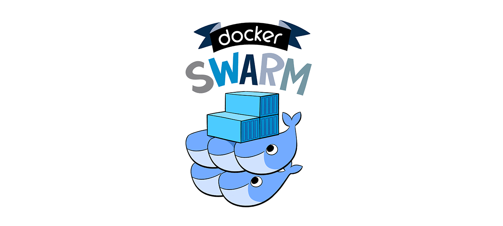
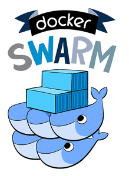

## Swarm 简介

　　

　　Docker Swarm 是 Docker 官方推出的容器集群管理工具，基于 Go 语言实现。代码开源在：https://github.com/docker/swarm 使用它可以将多个 Docker 主机封装为单个大型的虚拟 Docker 主机，快速打造一套容器云平台。

　　Docker Swarm 是生产环境中运行 Docker 应用程序最简单的方法。作为容器集群管理器，Swarm 最大的优势之一就是 100% 支持标准的 Docker API。各种基于标准 API 的工具比如 Compose、docker-py、各种管理软件，甚至 Docker 本身等都可以很容易的与 Swarm 进行集成。大大方便了用户将原先基于单节点的系统移植到 Swarm 上，同时 Swarm 内置了对 Docker 网络插件的支持，用户可以很容易地部署跨主机的容器集群服务。

　　Docker Swarm 和 Docker Compose 一样，都是 Docker 官方容器编排工具，但不同的是，**Docker Compose** 是一个在**单个服务器或主机上创建多个容器的工具**，而 **Docker Swarm** 则可以在**多个服务器或主机上创建容器集群服务**，对于微服务的部署，显然 Docker Swarm 会更加适合。

　　

## Swarm 核心概念

　　

### Swarm

　　Docker Engine 1.12 引入了 Swarm 模式，一个 Swarm 由多个 Docker 主机组成，它们以 Swarm 集群模式运行。Swarm 集群由 **Manager 节点**（管理者角色，管理成员和委托任务）和 **Worker 节点**（工作者角色，运行 Swarm 服务）组成。这些 Docker 主机有些是 Manager 节点，有些是 Worker 节点，或者同时扮演这两种角色。

　　Swarm 创建服务时，需要指定要使用的镜像、在运行的容器中执行的命令、定义其副本的数量、可用的网络和数据卷、将服务公开给外部的端口等等。与独立容器相比，群集服务的主要优势之一是，你可以修改服务的配置，包括它所连接的网络和数据卷等，而不需要手动重启服务。还有就是，如果一个 Worker Node 不可用了，Docker 会调度不可用 Node 的 Task 任务到其他 Nodes 上。

　　

### Nodes

　　

　　Swarm 集群由 **Manager 节点**（管理者角色，管理成员和委托任务）和 **Worker 节点**（工作者角色，运行 Swarm 服务）组成。一个节点就是 Swarm 集群中的一个实例，也就是一个 Docker 主机。你可以运行一个或多个节点在单台物理机或云服务器上，但是生产环境上，典型的部署方式是：Docker 节点交叉分布式部署在多台物理机或云主机上。节点名称默认为机器的 hostname。

- **Manager**：负责整个集群的管理工作包括集群配置、服务管理、容器编排等所有跟集群有关的工作，它会选举出一个 leader 来指挥编排任务；
- **Worker**：工作节点接收和执行从管理节点分派的任务（Tasks）运行在相应的服务（Services）上。

　　

### Services and Tasks

　　

　　**服务**（Service）是一个抽象的概念，是对要在管理节点或工作节点上执行的**任务的定义**。它是集群系统的中心结构，是用户与集群交互的主要根源。Swarm 创建服务时，可以为服务定义以下信息：

- 服务名称；
- 使用哪个镜像来创建容器；
- 要运行多少个副本；
- 服务的容器要连接到哪个网络上；
- 要映射哪些端口。

　　**任务**（Task）包括**一个 Docker 容器**和**在容器中运行的命令**。任务是一个集群的最小单元，任务与容器是一对一的关系。管理节点根据服务规模中设置的副本数量将任务分配给工作节点。一旦任务被分配到一个节点，便无法移动到另一个节点。它只能在分配的节点上运行或失败。

　　

### Replicated and global services

　　

　　Swarm 不只是提供了优秀的高可用性，同时也提供了节点的**弹性扩容和缩容**的功能。可以通过以下两种类型的 Services 部署实现：

- **Replicated Services**：当服务需要动态扩缩容时，只需通过 `scale` 参数或者 `--replicas n` 参数指定运行相同任务的数量，即可复制出新的副本，将一系列复制任务分发至各节点当中，这种操作便称之为**副本服务**（Replicate）。
- **Global Services**：我们也可以通过 `--mode global` 参数将服务分发至全部节点之上，这种操作我们称之为**全局服务**（Global）。在每个节点上运行一个相同的任务，不需要预先指定任务的数量，每增加一个节点到 Swarm 中，协调器就会创建一个任务，然后调度器把任务分配给新节点。

　　下图用黄色表示拥有三个副本服务 Replicated Service，用灰色表示拥有一个全局服务 Global Service。

　　

## Swarm 工作流程

　　

Swarm Manager：

1. API：接受命令并创建 service 对象（创建对象）
2. orchestrator：为 service 对象创建的 task 进行编排工作（服务编排）
3. allocater：为各个 task 分配 IP 地址（分配 IP）
4. dispatcher：将 task 分发到 nodes（分发任务）
5. scheduler：安排一个 worker 节点运行 task（运行任务）

　　

Worker Node：

1. worker：连接到调度器，检查分配的 task（检查任务）
2. executor：执行分配给 worker 节点的 task（执行任务）

　　

## Overlay 网络

　　

　　关于 Docker 的网络我们在《Docker 网络模式详解及容器间网络通信》中已经给大家详细讲解过。不过，Docker Swarm 集群模式下却默认使用的是 Overlay 网络（覆盖网络），这里简单介绍一下什么是 Overlay 网络。

　　Overlay 网络其实并不是一门新技术，它是指构建在另一个网络上的计算机网络，这是一种网络虚拟化技术的形式，近年来云计算虚拟化技术的演进促进了网络虚拟化技术的应用。所以 Overlay 网络就是建立在另一个计算机网络之上的虚拟网络，它是不能独立出现的，Overlay 底层依赖的网络就是 Underlay 网络。

　　Underlay 网络是专门用来承载用户 IP 流量的基础架构层，它与 Overlay 网络之间的关系有点类似物理机和虚拟机。Underlay 网络和物理机都是真正存在的实体，它们分别对应着真实存在的网络设备和计算设备，而 Overlay 网络和虚拟机都是依托在下层实体的基础之上，使用软件虚拟出来的层级。

　　在 Docker 版本 1.12 以后 **Swarm 模式原生已支持覆盖网络**（Overlay Network），只要是这个覆盖网络内的容器，不管在不在同一个宿主机上都能相互通信，即跨主机通信。不同覆盖网络内的容器之间是相互隔离的（相互 ping 不通）。

　　Overlay 网络是目前主流的容器跨节点数据传输和路由方案。当然，容器在跨主机进行通信的时候，除了可以使用 overlay 网络模式进行通信之外，还可以使用 host 网络模式，直接使用物理机的 IP 地址就可以进行通信。

　　

## 参考资料

　　

- https://docs.docker.com/engine/swarm/
- https://docs.docker.com/engine/swarm/key-concepts/
- https://docs.docker.com/engine/swarm/swarm-tutorial/
- https://docs.docker.com/engine/swarm/how-swarm-mode-works/nodes/
- https://docs.docker.com/engine/swarm/how-swarm-mode-works/services/

　　

　　最后我要说的是，如果只是从使用的角度出发，Docker Swarm 很快就可以上手。所谓知其然知其所以然，概念性的东西该懂还得懂，一些细节的部分比如网络我们到时候再另开文章细说。

　　下文带大家从零开始，搭建 Docker Swarm 集群环境，并通过 Swarm 实现服务的弹性部署。

