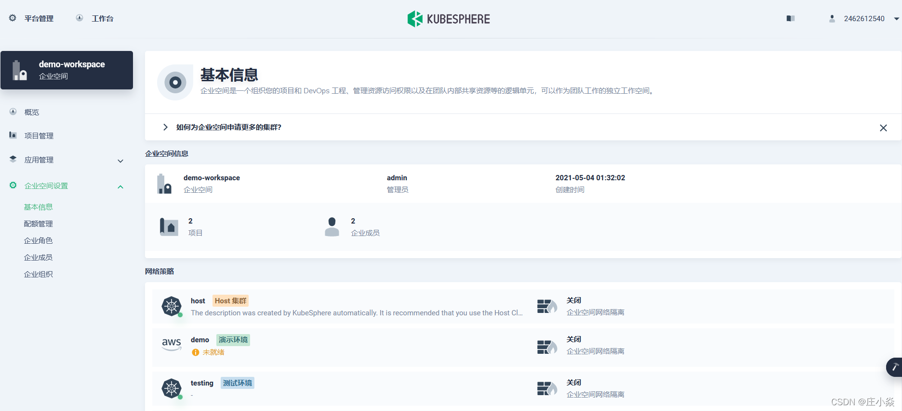

# Kubernetes的容器编排与管理

Kubernetes是一个开源的，用于管理云平台中多个主机上的容器化的应用，Kubernetes的目标是让部署容器化的应用简单并且高效（powerful）,
Kubernetes提供了应用部署，规划，更新，维护的一种机制。Kubernetes一个核心的特点就是能够自主的管理容器，
来保证云平台中的容器按照用户的期望状态运行着管理员可以加载一个微型服务，让规划器来找到合适的位置，
同时，Kubernetes也系统提升工具以及人性化方面，让用户能够方便的部署自己的应用。
现在Kubernetes着重于不间断的服务状态（比如web服务器或者缓存服务器）和原生云平台应用（Nosql）,
在不久的将来会支持各种生产云平台中的各种服务，例如，分批，工作流，以及传统数据库。总之就是一句话：用于管理docker容器的平台。

## K8s在Ubuntu18.04的集群构建实战

### 1.1 环境准备
```bash
# 1 开启Ubuntu的远程ssh访问
# 首先在服务器上安装ssh的服务器端。
sudo apt-get install ssh
# 启动ssh访问
sudo /etc/init.d/ssh start
```
```bash
# 2 关闭三台机器的防火墙：
#临时关闭
systemctl stop firewalld
#永久关闭
systemctl disable firewalld
```
```bash
# 3、关闭swap
swapoff -a
rm -f /swap.img
# 或者是使用
vim /etc/fstab
# /swap.img
```
```bash
# 4、开启ip转发
vim /etc/sysctl.conf
net.ipv4.ip_forward=1
#查看状态
sysctl -p
```

### 1.2 容器安装
```bash
#1、更新 apt 包索引
sudo apt-get update
#2、添加 Docker 的官方 GPG 密钥：
curl -fsSL https://mirrors.ustc.edu.cn/docker-ce/linux/ubuntu/gpg | sudo apt-key add -
#3、更新 apt 包索引
sudo apt-get update
#4、安装最新版本的 Docker Engine-Community 和 containerd ，或者转到下一步安装特定版本：
sudo apt-get install docker-ce docker-ce-cli containerd.io
#5、设置开机启动
systemctl enable docker && systemctl start docker
```
```bash
# 1修改镜像源
vim /etc/docker/daemon.json
{
  "registry-mirrors": ["https://b9pmyelo.mirror.aliyuncs.com"]
}
#2、重启docker
systemctl restart docker
#3、查看docker 信息
docker info
```

### 1.3 k8s安装
```bash
#1、安装依赖
sudo apt-get update
sudo apt-get -y install apt-transport-https ca-certificates curl software-properties-common
#2、安装GPG证书
curl -fsSL https://mirrors.aliyun.com/docker-ce/linux/ubuntu/gpg | sudo apt-key add -
#3、写入软件源信息
sudo add-apt-repository "deb [arch=amd64] https://mirrors.aliyun.com/docker-ce/linux/ubuntu $(lsb_release -cs) stable"
```
```bash
#1、安装k8s 添加证书
curl https://mirrors.aliyun.com/kubernetes/apt/doc/apt-key.gpg | apt-key add - 
#2、添加apt源
cat <<EOF >/etc/apt/sources.list.d/kubernetes.list
deb https://mirrors.aliyun.com/kubernetes/apt/ kubernetes-xenial main
EOF  
apt-get update
```
```bash
# 1、安装指定版本
apt-get install -y kubelet=1.19.0-00 kubeadm=1.19.0-00 kubectl=1.19.0-00
# 2、设置开机启动
sudo systemctl enable kubelet && sudo systemctl start kubelet
# 3、查看所需镜像
kubeadm config images list --kubernetes-version=v1.19.0
 
k8s.gcr.io/kube-apiserver:v1.19.0-00
k8s.gcr.io/kube-controller-manager:v1.19.0-00
k8s.gcr.io/kube-scheduler:v1.19.0-00
k8s.gcr.io/kube-proxy:v1.19.0-00
k8s.gcr.io/pause:3.2
k8s.gcr.io/etcd:3.4.9-1
k8s.gcr.io/coredns:1.7.0
# 4、从新地址下载镜像
docker pull registry.cn-hangzhou.aliyuncs.com/google_containers/kube-apiserver:v1.19.0
docker pull registry.cn-hangzhou.aliyuncs.com/google_containers/kube-controller-manager:v1.19.0
docker pull registry.cn-hangzhou.aliyuncs.com/google_containers/kube-scheduler:v1.19.0
docker pull registry.cn-hangzhou.aliyuncs.com/google_containers/kube-proxy:v1.19.0
docker pull registry.cn-hangzhou.aliyuncs.com/google_containers/pause:3.2
docker pull registry.cn-hangzhou.aliyuncs.com/google_containers/etcd:3.4.9-1
docker pull registry.cn-hangzhou.aliyuncs.com/google_containers/coredns:1.7.0
```

### 1.4 主节点配置

```bash
# 1、master节点初始化
kubeadm init --kubernetes-version=v1.18.4 --pod-network-cidr=10.244.0.0/16 --service-cidr=10.96.0.0/12 --ignore-preflight-errors=all
#2、 按照提示实行相关的命令
mkdir -p $HOME/.kube
sudo cp -i /etc/kubernetes/admin.conf $HOME/.kube/config
sudo chown $(id -u):$(id -g) $HOME/.kube/config
kubectl get nodes
NAME         STATUS   ROLES    AGE   VERSION
k8s-master   Ready    master   2m   v1.18.0
```
```bash
#1、添加网络组件
kubectl apply -f https://raw.githubusercontent.com/coreos/flannel/master/Documentation/kube-flannel.yml
#2、检查状态
kubectl get pods -n kube-system -l app=flannel
#3、检查节点是否准备完成
kubectl get nodes
```

### 1.5 从节点配置
```bash
# 加入集群相关命令
kubeadm join 192.168.25.137:6443 --token 7mhyb8.8551b40phda2ysep \
    --discovery-token-ca-cert-hash sha256:8aefb406e7d36c0be1e883b2c5489a1795e966316cf41e463858cd9c9c59c988
#默认token有效期为24小时，当过期之后，该token就不可用了。这时就需要重新创建token，操作如下：
kubeadm token create --print-join-command
kubeadm join 192.168.25.137:6443 --token nuja6n.o3jrhsffiqs9swnu --discovery-token-ca-cert-hash sha256:63bca849e0e01691ae14eab449570284f0c3ddeea590f8da988c07fe2729e924
```

### 1.6 集群网络配置
```bash
在 master 的时候就已经完了
#1、添加网络组件
kubectl apply -f https://raw.githubusercontent.com/coreos/flannel/master/Documentation/kube-flannel.yml
#2、检查状态
kubectl get pods -n kube-system -l app=flannel
#3、检查节点是否准备完成
kubectl get nodes
```


## KubeSphere构建实战

KubeSphere 愿景是打造一个以 Kubernetes 为内核的云原生分布式操作系统，
它的架构可以非常方便地使第三方应用与云原生生态组件进行即插即用（plug-and-play）的集成，
支持云原生应用在多云与多集群的统一分发和运维管理。

### 安装环境准备
- 如需在 Kubernetes 上安装 KubeSphere 3.2.1，您的 Kubernetes 版本必须为：1.19.x、1.20.x、1.21.x 或 1.22.x（实验性支持）。
- 确保您的机器满足最低硬件要求：CPU > 1 核，内存 > 2 GB。
- 在安装之前，需要配置 Kubernetes 集群中的默认存储类型。
- 当使用 --cluster-signing-cert-file 和 --cluster-signing-key-file 参数启动时，在 kube-apiserver 中会激活 CSR 签名功能。请参见 RKE 安装问题。
- 有关在 Kubernetes 上安装 KubeSphere 的准备工作，请参见准备工作。

### 安装Kubernetes环境
 参考上面：K8s在Ubuntu18.04的集群构建实战

### 安装nfs文件系统
```bash
# 在每个机器
yum install -y nfs-utils
# 在master 执行以下命令 
echo "/nfs/data/ *(insecure,rw,sync,no_root_squash)" > /etc/exports
# 执行以下命令，启动 nfs 服务;创建共享目录
mkdir -p /nfs/data
# 在master执行
systemctl enable rpcbind
systemctl enable nfs-server
systemctl start rpcbind
systemctl start nfs-server
# 使配置生效
exportfs -r
#检查配置是否生效
exportfs
配置nfs-client
showmount -e 172.31.0.4(自己的IP地址)
mkdir -p /nfs/data
mount -t nfs 172.31.0.4(自己的IP地址):/nfs/data /nfs/data
```
配置默认存储
```bash
vim sc.yaml
--------------------------------------------------------------------------
## 创建了一个存储类
apiVersion: storage.k8s.io/v1
kind: StorageClass
metadata:
  name: nfs-storage
  annotations:
    storageclass.kubernetes.io/is-default-class: "true"
provisioner: k8s-sigs.io/nfs-subdir-external-provisioner
parameters:
  archiveOnDelete: "true"  ## 删除pv的时候，pv的内容是否要备份
 
---
apiVersion: apps/v1
kind: Deployment
metadata:
  name: nfs-client-provisioner
  labels:
    app: nfs-client-provisioner
  # replace with namespace where provisioner is deployed
  namespace: default
spec:
  replicas: 1
  strategy:
    type: Recreate
  selector:
    matchLabels:
      app: nfs-client-provisioner
  template:
    metadata:
      labels:
        app: nfs-client-provisioner
    spec:
      serviceAccountName: nfs-client-provisioner
      containers:
        - name: nfs-client-provisioner
          image: registry.cn-hangzhou.aliyuncs.com/lfy_k8s_images/nfs-subdir-external-provisioner:v4.0.2
          # resources:
          #    limits:
          #      cpu: 10m
          #    requests:
          #      cpu: 10m
          volumeMounts:
            - name: nfs-client-root
              mountPath: /persistentvolumes
          env:
            - name: PROVISIONER_NAME
              value: k8s-sigs.io/nfs-subdir-external-provisioner
            - name: NFS_SERVER
              value: 172.31.0.4 ## 指定自己nfs服务器地址
            - name: NFS_PATH  
              value: /nfs/data  ## nfs服务器共享的目录
      volumes:
        - name: nfs-client-root
          nfs:
            server: 172.31.0.4
            path: /nfs/data
---
apiVersion: v1
kind: ServiceAccount
metadata:
  name: nfs-client-provisioner
  # replace with namespace where provisioner is deployed
  namespace: default
---
kind: ClusterRole
apiVersion: rbac.authorization.k8s.io/v1
metadata:
  name: nfs-client-provisioner-runner
rules:
  - apiGroups: [""]
    resources: ["nodes"]
    verbs: ["get", "list", "watch"]
  - apiGroups: [""]
    resources: ["persistentvolumes"]
    verbs: ["get", "list", "watch", "create", "delete"]
  - apiGroups: [""]
    resources: ["persistentvolumeclaims"]
    verbs: ["get", "list", "watch", "update"]
  - apiGroups: ["storage.k8s.io"]
    resources: ["storageclasses"]
    verbs: ["get", "list", "watch"]
  - apiGroups: [""]
    resources: ["events"]
    verbs: ["create", "update", "patch"]
---
kind: ClusterRoleBinding
apiVersion: rbac.authorization.k8s.io/v1
metadata:
  name: run-nfs-client-provisioner
subjects:
  - kind: ServiceAccount
    name: nfs-client-provisioner
    # replace with namespace where provisioner is deployed
    namespace: default
roleRef:
  kind: ClusterRole
  name: nfs-client-provisioner-runner
  apiGroup: rbac.authorization.k8s.io
---
kind: Role
apiVersion: rbac.authorization.k8s.io/v1
metadata:
  name: leader-locking-nfs-client-provisioner
  # replace with namespace where provisioner is deployed
  namespace: default
rules:
  - apiGroups: [""]
    resources: ["endpoints"]
    verbs: ["get", "list", "watch", "create", "update", "patch"]
---
kind: RoleBinding
apiVersion: rbac.authorization.k8s.io/v1
metadata:
  name: leader-locking-nfs-client-provisioner
  # replace with namespace where provisioner is deployed
  namespace: default
subjects:
  - kind: ServiceAccount
    name: nfs-client-provisioner
    # replace with namespace where provisioner is deployed
    namespace: default
roleRef:
  kind: Role
  name: leader-locking-nfs-client-provisioner
  apiGroup: rbac.authorization.k8s.io
```
```bash
#确认配置是否生效
kubectl get sc
```

### 安装集群指标监控组件
```bash
apiVersion: v1
kind: ServiceAccount
metadata:
  labels:
    k8s-app: metrics-server
  name: metrics-server
  namespace: kube-system
---
apiVersion: rbac.authorization.k8s.io/v1
kind: ClusterRole
metadata:
  labels:
    k8s-app: metrics-server
    rbac.authorization.k8s.io/aggregate-to-admin: "true"
    rbac.authorization.k8s.io/aggregate-to-edit: "true"
    rbac.authorization.k8s.io/aggregate-to-view: "true"
  name: system:aggregated-metrics-reader
rules:
- apiGroups:
  - metrics.k8s.io
  resources:
  - pods
  - nodes
  verbs:
  - get
  - list
  - watch
---
apiVersion: rbac.authorization.k8s.io/v1
kind: ClusterRole
metadata:
  labels:
    k8s-app: metrics-server
  name: system:metrics-server
rules:
- apiGroups:
  - ""
  resources:
  - pods
  - nodes
  - nodes/stats
  - namespaces
  - configmaps
  verbs:
  - get
  - list
  - watch
---
apiVersion: rbac.authorization.k8s.io/v1
kind: RoleBinding
metadata:
  labels:
    k8s-app: metrics-server
  name: metrics-server-auth-reader
  namespace: kube-system
roleRef:
  apiGroup: rbac.authorization.k8s.io
  kind: Role
  name: extension-apiserver-authentication-reader
subjects:
- kind: ServiceAccount
  name: metrics-server
  namespace: kube-system
---
apiVersion: rbac.authorization.k8s.io/v1
kind: ClusterRoleBinding
metadata:
  labels:
    k8s-app: metrics-server
  name: metrics-server:system:auth-delegator
roleRef:
  apiGroup: rbac.authorization.k8s.io
  kind: ClusterRole
  name: system:auth-delegator
subjects:
- kind: ServiceAccount
  name: metrics-server
  namespace: kube-system
---
apiVersion: rbac.authorization.k8s.io/v1
kind: ClusterRoleBinding
metadata:
  labels:
    k8s-app: metrics-server
  name: system:metrics-server
roleRef:
  apiGroup: rbac.authorization.k8s.io
  kind: ClusterRole
  name: system:metrics-server
subjects:
- kind: ServiceAccount
  name: metrics-server
  namespace: kube-system
---
apiVersion: v1
kind: Service
metadata:
  labels:
    k8s-app: metrics-server
  name: metrics-server
  namespace: kube-system
spec:
  ports:
  - name: https
    port: 443
    protocol: TCP
    targetPort: https
  selector:
    k8s-app: metrics-server
---
apiVersion: apps/v1
kind: Deployment
metadata:
  labels:
    k8s-app: metrics-server
  name: metrics-server
  namespace: kube-system
spec:
  selector:
    matchLabels:
      k8s-app: metrics-server
  strategy:
    rollingUpdate:
      maxUnavailable: 0
  template:
    metadata:
      labels:
        k8s-app: metrics-server
    spec:
      containers:
      - args:
        - --cert-dir=/tmp
        - --kubelet-insecure-tls
        - --secure-port=4443
        - --kubelet-preferred-address-types=InternalIP,ExternalIP,Hostname
        - --kubelet-use-node-status-port
        image: registry.cn-hangzhou.aliyuncs.com/lfy_k8s_images/metrics-server:v0.4.3
        imagePullPolicy: IfNotPresent
        livenessProbe:
          failureThreshold: 3
          httpGet:
            path: /livez
            port: https
            scheme: HTTPS
          periodSeconds: 10
        name: metrics-server
        ports:
        - containerPort: 4443
          name: https
          protocol: TCP
        readinessProbe:
          failureThreshold: 3
          httpGet:
            path: /readyz
            port: https
            scheme: HTTPS
          periodSeconds: 10
        securityContext:
          readOnlyRootFilesystem: true
          runAsNonRoot: true
          runAsUser: 1000
        volumeMounts:
        - mountPath: /tmp
          name: tmp-dir
      nodeSelector:
        kubernetes.io/os: linux
      priorityClassName: system-cluster-critical
      serviceAccountName: metrics-server
      volumes:
      - emptyDir: {}
        name: tmp-dir
---
apiVersion: apiregistration.k8s.io/v1
kind: APIService
metadata:
  labels:
    k8s-app: metrics-server
  name: v1beta1.metrics.k8s.io
spec:
  group: metrics.k8s.io
  groupPriorityMinimum: 100
  insecureSkipTLSVerify: true
  service:
    name: metrics-server
    namespace: kube-system
  version: v1beta1
  versionPriority: 100
```

### 安装KubeSphere
```bash
wget https://github.com/kubesphere/ks-installer/releases/download/v3.1.1/kubesphere-installer.yaml
wget https://github.com/kubesphere/ks-installer/releases/download/v3.1.1/cluster-configuration.yaml
```
修改cluster-configuration
```bash
# 在 cluster-configuration.yaml中指定我们需要开启的功能  参照官网“启用可插拔组件” 
https://kubesphere.com.cn/docs/pluggable-components/overview/
```
kubesphere-installer.yaml
```bash
---
apiVersion: apiextensions.k8s.io/v1beta1
kind: CustomResourceDefinition
metadata:
  name: clusterconfigurations.installer.kubesphere.io
spec:
  group: installer.kubesphere.io
  versions:
  - name: v1alpha1
    served: true
    storage: true
  scope: Namespaced
  names:
    plural: clusterconfigurations
    singular: clusterconfiguration
    kind: ClusterConfiguration
    shortNames:
    - cc
 
---
apiVersion: v1
kind: Namespace
metadata:
  name: kubesphere-system
 
---
apiVersion: v1
kind: ServiceAccount
metadata:
  name: ks-installer
  namespace: kubesphere-system
 
---
apiVersion: rbac.authorization.k8s.io/v1
kind: ClusterRole
metadata:
  name: ks-installer
rules:
- apiGroups:
  - ""
  resources:
  - '*'
  verbs:
  - '*'
- apiGroups:
  - apps
  resources:
  - '*'
  verbs:
  - '*'
- apiGroups:
  - extensions
  resources:
  - '*'
  verbs:
  - '*'
- apiGroups:
  - batch
  resources:
  - '*'
  verbs:
  - '*'
- apiGroups:
  - rbac.authorization.k8s.io
  resources:
  - '*'
  verbs:
  - '*'
- apiGroups:
  - apiregistration.k8s.io
  resources:
  - '*'
  verbs:
  - '*'
- apiGroups:
  - apiextensions.k8s.io
  resources:
  - '*'
  verbs:
  - '*'
- apiGroups:
  - tenant.kubesphere.io
  resources:
  - '*'
  verbs:
  - '*'
- apiGroups:
  - certificates.k8s.io
  resources:
  - '*'
  verbs:
  - '*'
- apiGroups:
  - devops.kubesphere.io
  resources:
  - '*'
  verbs:
  - '*'
- apiGroups:
  - monitoring.coreos.com
  resources:
  - '*'
  verbs:
  - '*'
- apiGroups:
  - logging.kubesphere.io
  resources:
  - '*'
  verbs:
  - '*'
- apiGroups:
  - jaegertracing.io
  resources:
  - '*'
  verbs:
  - '*'
- apiGroups:
  - storage.k8s.io
  resources:
  - '*'
  verbs:
  - '*'
- apiGroups:
  - admissionregistration.k8s.io
  resources:
  - '*'
  verbs:
  - '*'
- apiGroups:
  - policy
  resources:
  - '*'
  verbs:
  - '*'
- apiGroups:
  - autoscaling
  resources:
  - '*'
  verbs:
  - '*'
- apiGroups:
  - networking.istio.io
  resources:
  - '*'
  verbs:
  - '*'
- apiGroups:
  - config.istio.io
  resources:
  - '*'
  verbs:
  - '*'
- apiGroups:
  - iam.kubesphere.io
  resources:
  - '*'
  verbs:
  - '*'
- apiGroups:
  - notification.kubesphere.io
  resources:
  - '*'
  verbs:
  - '*'
- apiGroups:
  - auditing.kubesphere.io
  resources:
  - '*'
  verbs:
  - '*'
- apiGroups:
  - events.kubesphere.io
  resources:
  - '*'
  verbs:
  - '*'
- apiGroups:
  - core.kubefed.io
  resources:
  - '*'
  verbs:
  - '*'
- apiGroups:
  - installer.kubesphere.io
  resources:
  - '*'
  verbs:
  - '*'
- apiGroups:
  - storage.kubesphere.io
  resources:
  - '*'
  verbs:
  - '*'
- apiGroups:
  - security.istio.io
  resources:
  - '*'
  verbs:
  - '*'
- apiGroups:
  - monitoring.kiali.io
  resources:
  - '*'
  verbs:
  - '*'
- apiGroups:
  - kiali.io
  resources:
  - '*'
  verbs:
  - '*'
- apiGroups:
  - networking.k8s.io
  resources:
  - '*'
  verbs:
  - '*'
- apiGroups:
  - kubeedge.kubesphere.io
  resources:
  - '*'
  verbs:
  - '*'
- apiGroups:
  - types.kubefed.io
  resources:
  - '*'
  verbs:
  - '*'
 
---
kind: ClusterRoleBinding
apiVersion: rbac.authorization.k8s.io/v1
metadata:
  name: ks-installer
subjects:
- kind: ServiceAccount
  name: ks-installer
  namespace: kubesphere-system
roleRef:
  kind: ClusterRole
  name: ks-installer
  apiGroup: rbac.authorization.k8s.io
 
---
apiVersion: apps/v1
kind: Deployment
metadata:
  name: ks-installer
  namespace: kubesphere-system
  labels:
    app: ks-install
spec:
  replicas: 1
  selector:
    matchLabels:
      app: ks-install
  template:
    metadata:
      labels:
        app: ks-install
    spec:
      serviceAccountName: ks-installer
      containers:
      - name: installer
        image: kubesphere/ks-installer:v3.1.1
        imagePullPolicy: "Always"
        resources:
          limits:
            cpu: "1"
            memory: 1Gi
          requests:
            cpu: 20m
            memory: 100Mi
        volumeMounts:
        - mountPath: /etc/localtime
          name: host-time
      volumes:
      - hostPath:
          path: /etc/localtime
          type: ""
        name: host-time
```
cluster-configuration.yaml
```bash
---
apiVersion: installer.kubesphere.io/v1alpha1
kind: ClusterConfiguration
metadata:
  name: ks-installer
  namespace: kubesphere-system
  labels:
    version: v3.1.1
spec:
  persistence:
    storageClass: ""        # If there is no default StorageClass in your cluster, you need to specify an existing StorageClass here.
  authentication:
    jwtSecret: ""           # Keep the jwtSecret consistent with the Host Cluster. Retrieve the jwtSecret by executing "kubectl -n kubesphere-system get cm kubesphere-config -o yaml | grep -v "apiVersion" | grep jwtSecret" on the Host Cluster.
  local_registry: ""        # Add your private registry address if it is needed.
  etcd:
    monitoring: true       # Enable or disable etcd monitoring dashboard installation. You have to create a Secret for etcd before you enable it.
    endpointIps: 172.31.0.4  # etcd cluster EndpointIps. It can be a bunch of IPs here.
    port: 2379              # etcd port.
    tlsEnable: true
  common:
    redis:
      enabled: true
    openldap:
      enabled: true
    minioVolumeSize: 20Gi # Minio PVC size.
    openldapVolumeSize: 2Gi   # openldap PVC size.
    redisVolumSize: 2Gi # Redis PVC size.
    monitoring:
      # type: external   # Whether to specify the external prometheus stack, and need to modify the endpoint at the next line.
      endpoint: http://prometheus-operated.kubesphere-monitoring-system.svc:9090 # Prometheus endpoint to get metrics data.
    es:   # Storage backend for logging, events and auditing.
      # elasticsearchMasterReplicas: 1   # The total number of master nodes. Even numbers are not allowed.
      # elasticsearchDataReplicas: 1     # The total number of data nodes.
      elasticsearchMasterVolumeSize: 4Gi   # The volume size of Elasticsearch master nodes.
      elasticsearchDataVolumeSize: 20Gi    # The volume size of Elasticsearch data nodes.
      logMaxAge: 7                     # Log retention time in built-in Elasticsearch. It is 7 days by default.
      elkPrefix: logstash              # The string making up index names. The index name will be formatted as ks-<elk_prefix>-log.
      basicAuth:
        enabled: false
        username: ""
        password: ""
      externalElasticsearchUrl: ""
      externalElasticsearchPort: ""
  console:
    enableMultiLogin: true  # Enable or disable simultaneous logins. It allows different users to log in with the same account at the same time.
    port: 30880
  alerting:                # (CPU: 0.1 Core, Memory: 100 MiB) It enables users to customize alerting policies to send messages to receivers in time with different time intervals and alerting levels to choose from.
    enabled: true         # Enable or disable the KubeSphere Alerting System.
    # thanosruler:
    #   replicas: 1
    #   resources: {}
  auditing:                # Provide a security-relevant chronological set of records，recording the sequence of activities happening on the platform, initiated by different tenants.
    enabled: true         # Enable or disable the KubeSphere Auditing Log System. 
  devops:                  # (CPU: 0.47 Core, Memory: 8.6 G) Provide an out-of-the-box CI/CD system based on Jenkins, and automated workflow tools including Source-to-Image & Binary-to-Image.
    enabled: true             # Enable or disable the KubeSphere DevOps System.
    jenkinsMemoryLim: 2Gi      # Jenkins memory limit.
    jenkinsMemoryReq: 1500Mi   # Jenkins memory request.
    jenkinsVolumeSize: 8Gi     # Jenkins volume size.
    jenkinsJavaOpts_Xms: 512m  # The following three fields are JVM parameters.
    jenkinsJavaOpts_Xmx: 512m
    jenkinsJavaOpts_MaxRAM: 2g
  events:                  # Provide a graphical web console for Kubernetes Events exporting, filtering and alerting in multi-tenant Kubernetes clusters.
    enabled: true         # Enable or disable the KubeSphere Events System.
    ruler:
      enabled: true
      replicas: 2
  logging:                 # (CPU: 57 m, Memory: 2.76 G) Flexible logging functions are provided for log query, collection and management in a unified console. Additional log collectors can be added, such as Elasticsearch, Kafka and Fluentd.
    enabled: true         # Enable or disable the KubeSphere Logging System.
    logsidecar:
      enabled: true
      replicas: 2
  metrics_server:                    # (CPU: 56 m, Memory: 44.35 MiB) It enables HPA (Horizontal Pod Autoscaler).
    enabled: false                   # Enable or disable metrics-server.
  monitoring:
    storageClass: ""                 # If there is an independent StorageClass you need for Prometheus, you can specify it here. The default StorageClass is used by default.
    # prometheusReplicas: 1          # Prometheus replicas are responsible for monitoring different segments of data source and providing high availability.
    prometheusMemoryRequest: 400Mi   # Prometheus request memory.
    prometheusVolumeSize: 20Gi       # Prometheus PVC size.
    # alertmanagerReplicas: 1          # AlertManager Replicas.
  multicluster:
    clusterRole: none  # host | member | none  # You can install a solo cluster, or specify it as the Host or Member Cluster.
  network:
    networkpolicy: # Network policies allow network isolation within the same cluster, which means firewalls can be set up between certain instances (Pods).
      # Make sure that the CNI network plugin used by the cluster supports NetworkPolicy. There are a number of CNI network plugins that support NetworkPolicy, including Calico, Cilium, Kube-router, Romana and Weave Net.
      enabled: true # Enable or disable network policies.
    ippool: # Use Pod IP Pools to manage the Pod network address space. Pods to be created can be assigned IP addresses from a Pod IP Pool.
      type: calico # Specify "calico" for this field if Calico is used as your CNI plugin. "none" means that Pod IP Pools are disabled.
    topology: # Use Service Topology to view Service-to-Service communication based on Weave Scope.
      type: none # Specify "weave-scope" for this field to enable Service Topology. "none" means that Service Topology is disabled.
  openpitrix: # An App Store that is accessible to all platform tenants. You can use it to manage apps across their entire lifecycle.
    store:
      enabled: true # Enable or disable the KubeSphere App Store.
  servicemesh:         # (0.3 Core, 300 MiB) Provide fine-grained traffic management, observability and tracing, and visualized traffic topology.
    enabled: true     # Base component (pilot). Enable or disable KubeSphere Service Mesh (Istio-based).
  kubeedge:          # Add edge nodes to your cluster and deploy workloads on edge nodes.
    enabled: true   # Enable or disable KubeEdge.
    cloudCore:
      nodeSelector: {"node-role.kubernetes.io/worker": ""}
      tolerations: []
      cloudhubPort: "10000"
      cloudhubQuicPort: "10001"
      cloudhubHttpsPort: "10002"
      cloudstreamPort: "10003"
      tunnelPort: "10004"
      cloudHub:
        advertiseAddress: # At least a public IP address or an IP address which can be accessed by edge nodes must be provided.
          - ""            # Note that once KubeEdge is enabled, CloudCore will malfunction if the address is not provided.
        nodeLimit: "100"
      service:
        cloudhubNodePort: "30000"
        cloudhubQuicNodePort: "30001"
        cloudhubHttpsNodePort: "30002"
        cloudstreamNodePort: "30003"
        tunnelNodePort: "30004"
    edgeWatcher:
      nodeSelector: {"node-role.kubernetes.io/worker": ""}
      tolerations: []
      edgeWatcherAgent:
        nodeSelector: {"node-role.kubernetes.io/worker": ""}
        tolerations: []
```

### 执行安装kubeSphere
```bash
kubectl apply -f kubesphere-installer.yaml
kubectl apply -f cluster-configuration.yaml
```

###  查看安装进度
```bash
kubectl logs -n kubesphere-system $(kubectl get pod -n kubesphere-system -l app=ks-install -o jsonpath='{.items[0].metadata.name}') -f
```
etcd监控证书找不到问题
```bash
kubectl -n kubesphere-monitoring-system create secret generic kube-etcd-client-certs  --from-file=etcd-client-ca.crt=/etc/kubernetes/pki/etcd/ca.crt  --from-file=etcd-client.crt=/etc/kubernetes/pki/apiserver-etcd-client.crt  --from-file=etcd-client.key=/etc/kubernetes/pki/apiserver-etcd-client.key
```

### 安装测试与登入
```bash
访问任意机器的 30880端口
账号 ： admin
密码 ： P@88w0rd
```




# 博文参考：

https://zhuangxiaoyan.blog.csdn.net/article/details/122674833
