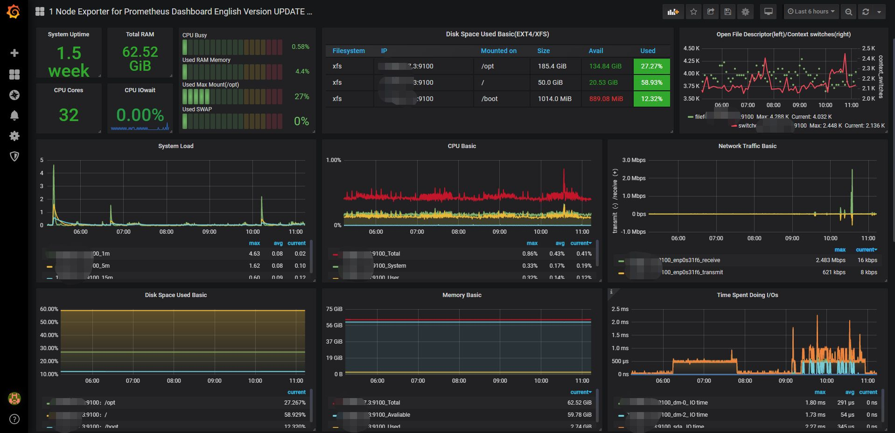

# Docker 构建的Grafan监控系统

Prometheus（普罗米修斯）是一套开源的监控&报警&时间序列数据库的组合，起始是由SoundCloud公司开发的。
随着发展，越来越多公司和组织接受采用Prometheus，社会也十分活跃，他们便将它独立成开源项目，并且有公司来运作。
Google SRE的书内也曾提到跟他们BorgMon监控系统相似的实现是Prometheus。
现在最常见的Kubernetes容器管理系统中，通常会搭配Prometheus进行监控。Prometheus应该是为数不多的适合Docker、Mesos、Kubernetes环境的监控系统之一。
输出被监控组件信息的HTTP接口被叫做exporter 。
目前互联网公司常用的组件大部分都有exporter可以直接使用，比如Varnish、Haproxy、Nginx、MySQL、Linux 系统信息 (包括磁盘、内存、CPU、网络等等)，
具体支持的源看：https://github.com/prometheus。

与其他监控系统相比，Prometheus的主要特点是：
- 一个多维数据模型（时间序列由指标名称定义和设置键/值尺寸）。
- 非常高效的存储，平均一个采样数据占~3.5bytes左右，320万的时间序列，每30秒采样，保持60天，消耗磁盘大概228G。
- 一种灵活的查询语言。
- 不依赖分布式存储，单个服务器节点。
- 时间集合通过HTTP上的PULL模型进行。
- 通过中间网关支持推送时间。
- 通过服务发现或静态配置发现目标。
- 多种模式的图形和仪表板支持。

# 采集的系统数据指标
- node 集群
- mysql 集群
- MOngoDB 集群
- nginx 集群
- redis 集群
- docker services 集群
- MQ 集群
- JMX 
- 邮件通知

# Prometheus的构建

# Grafan的构建

# node的监控构建

# mysql 集群

# MOngoDB 集群

# nginx 集群

# redis 集群

# docker services 集群

# MQ 集群

# JMX 构建

# 邮件通知

