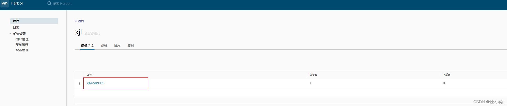
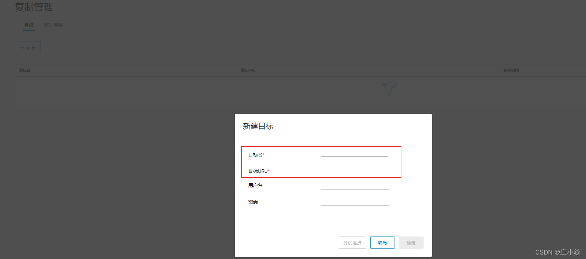
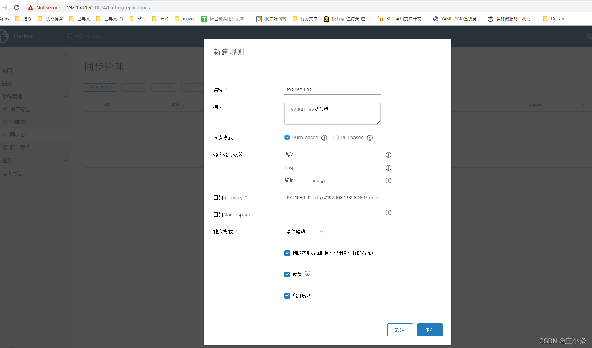

# 私有仓库的构建

## 私有仓库 docker registry的构建

### 配置机器环境
```bash
#  <!--docker宿主机开启路由功能-->
echo "net.ipv4.ip_forward = 1" >> /etc/sysctl.conf
# <!--刷新配置-->
sysctl -p
net.ipv4.ip_forward = 1
# <!--配置镜像加速-->
vim /etc/docker/daemon.json
#  <!--添加阿里云加速-->
{"registry-mirrors":["https://6kx4zyno.mirror.aliyuncs.com"]}
# <!--重新启动docker服务-->
systemctl reload docker
```

### 拉取镜像
```bash
# 查询镜像
docker search registry
# 拉取私有仓库镜像
docker pull registry
```

### 运行的 registry容器
```bash
# <!--registry镜像可以直接先pull下来，也可以不下载，根据自己情况而定-->
docker run -d -p 5000:5000 --name registry --restart=always -v /opt/registry:/var/lib/registry registry
# <!--查看docker运行的容器-->
docker ps
# <!--查看docker所有镜像-->
docker images  
# <!--配置docker服务支持registry服务-->
vim /etc/docker/daemon.json 
{"registry-mirrors":["https://6kx4zyno.mirror.aliyuncs.com"],
"insecure-registries":["192.168.100.10:5000"]  <!--添加此行-->
}
# <!--重新启动docker服务-->
systemctl reload docker 
docker info
```

### 上传与下载镜像
```bash
# 给镜像打标签
docker tag mysql 192.168.25.140:5000/mysql
 
# 上传的镜像
docker push 192.168.25.140:5000/mysql
 
# <!--客户端下载私有仓库中的镜像-->
docker pull 192.168.25.140:5000/mysql 

# <!--查看镜像是否下载成功-->
docker images 
```

### 配置registry加载身份验证
```bash
# <!--安装加密工具httpd-tools-->
yum -y install httpd-tools  
# <!--创建存放验证密钥目录-->
mkdir /opt/registry-auth
# <!--配置registry身份验证数据库-->
# <!--"-Bbn”参数解释：B强制密码加密；b在命令中输入密码，不提示输入密码；n不更新密钥文件-->
htpasswd -Bbn bob pwd@123 > /opt/registry-auth/htpasswd
# <!--删除此服务器上的所有容器，接下来重新生成一个需要身份验证的私有仓库容器-->
docker run -d -p 5000:5000 --restart=always \
-v /opt/registry-auth/:/auth/ \
-v /opt/registry:/var/lib/registry --name registry-auth -e "REGISTRY_AUTH=htpasswd" \
-e "REGISTRY_AUTH_HTPASSWD_REALM=Registry Realm" \
-e "REGISTRY_AUTH_HTPASSWD_PATH=/auth/htpasswd" registry 
#<!--重新运行一个支持身份验证的registry私有镜像仓库容器-->
docker tag tomcat:latest 192.168.100.10:5000/image/tomcat:1.0 
docker push 192.168.100.10:5000/image/tomcat:1.0
# <!--测试不通过身份验证是否可以往私有仓库上传镜像-->
# <!--提示没有身份验证，上传不了-->
no basic auth credentials
# <!--登录私有镜像仓库，通过身份验证即可上传-->
docker login 192.168.100.10:5000 
Username: bob   <!--输入bob-->
Password:    <!--输入密码-->
# <!--再次上传镜像到私有仓库-->
docker push 192.168.100.10:5000/image/tomcat:1.0 
# <!--docker客户端不通过身份验证直接下载私有仓库中的镜像直接被拒绝-->
docker pull 192.168.100.10:5000/image/tomcat:1.0
Error response from daemon: Get http://192.168.100.10:5000/v2/image/tomcat/manifests/1.0: no basic auth credentials
# <!--登录私有仓库，通过身份验证-->
docker login 192.168.100.10:5000 
Username: bob  <!--输入bob-->
Password:     <!--输入密码-->
# <!--下载私有仓库中的镜像-->
docker pull 192.168.100.10:5000/image/tomcat:1.0 
# <!--查看docker客户端镜像-->
docker images
```

## 私有仓库 docker Harbor的构建

Docker容器应用的开发和运行离不开可靠的镜像管理，虽然Docker官方也提供了公共的镜像仓库，
但是从安全和效率等方面考虑，部署私有环境内的Registry也是非常必要的。
Harbor是由VMware公司开源的企业级的Docker Registry管理项目，
它包括权限管理(RBAC)、LDAP、日志审核、管理界面、自我注册、镜像复制和中文支持等功能

### 安装docker和docker-compose
```shell
curl -L https://github.com/docker/compose/releases/download/1.13.0/docker-compose-`uname -s`-`uname -m` > /usr/local/bin/docker-compose
sudo chmod +x /usr/local/bin/docker-compose
```
```shell
# 修改docker配置

vim /etc/docker/daemon.json
 
# 添加该行，ip为服务器ip
{
     "registry-mirrors": ["https://docker.mirrors.ustc.edu.cn"],
 
     "insecure-registries":["仓库的ip地址"]
}
```

```shell
# 重启docker服务
systemctl restart docker
```


### 安装Harbor
```shell
# 下载压缩包
wget https://github.com/vmware/harbor/releases/download/v1.1.2/harbor-online-installer-v1.1.2.tgz
#解压文件
tar xvf harbor-online-installer-v1.1.2.tgz
#编辑文件
vim harbor/harbor.cfg 
```
```shell
# 修改配置文件

# hostname设置访问地址，可以使用ip、域名，不可以设置为127.0.0.1或localhost。
hostname = 192.168.25.140
 
# 访问协议，默认是http，也可以设置https，如果设置https，则nginx ssl需要设置on
ui_url_protocol = http
 
# mysql数据库root用户默认密码root123，实际使用时修改下
db_password = harbor
 
max_job_workers = 3 
customize_crt = on
ssl_cert = /data/cert/server.crt
ssl_cert_key = /data/cert/server.key
secretkey_path = /data
admiral_url = NA
 
# 邮件设置，发送重置密码邮件时使用
email_identity = 
email_server = 你的邮箱
email_server_port = 25
email_username = 邮箱的账号
email_password = 邮箱的密码
email_from = admin <sample_admin@mydomain.com>
email_ssl = false
 
# 启动Harbor后，管理员UI登录的密码，默认是Harbor12345 账户是admin
harbor_admin_password = 初始仓库密码
 
# 认证方式，这里支持多种认证方式，如LADP、本次存储、数据库认证。默认是db_auth，mysql数据库认证
auth_mode = db_auth
 
# LDAP认证时配置项
#ldap_url = ldaps://ldap.mydomain.com
#ldap_searchdn = uid=searchuser,ou=people,dc=mydomain,dc=com
#ldap_search_pwd = password
#ldap_basedn = ou=people,dc=mydomain,dc=com
#ldap_filter = (objectClass=person)
#ldap_uid = uid 
#ldap_scope = 3 
#ldap_timeout = 5
 
# 是否开启自注册
self_registration = on
 
# Token有效时间，默认30分钟
token_expiration = 30
 
# 用户创建项目权限控制，默认是everyone（所有人），也可以设置为adminonly（只能管理员）
project_creation_restriction = everyone
 
verify_remote_cert = on
```
```shell
# 执行安装脚本
./install.sh
# 安装成功的脚本 
----Harbor has been installed and started successfully.----
Now you should be able to visit the admin portal at http://10.68.7.20   . 
For more details, please visit https://github.com/vmware/harbor .
```


#### 仓库镜像上传与下载
```shell
docker login 192.168.25.140
Authenticating with existing credentials...
WARNING! Your password will be stored unencrypted in /root/.docker/config.json.
Configure a credential helper to remove this warning. See
https://docs.docker.com/engine/reference/commandline/login/#credentials-store

Login Succeeded

# 镜像打标签
docker tag 镜像名称 仓库IP/项目的仓库名/镜像名称
# 镜像的上传
docker push 仓库IP/项目的仓库名/镜像名称
```

### Harbor集群搭建

我们将192.168.25.140作为主节点，192.168.25.128，192.168.25.150作为从节点。当我们往主节点上面Push镜像的时候，自动复制到节点上面。






