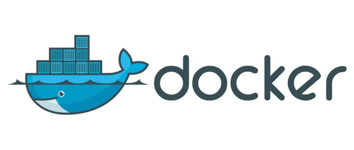

# Docker-Principle
本项目主要介绍Docker的相关的原理与实践操作，同时涉及实践问题和解答方案

-----------------------------------------------------------------------------------------------
其他平台将同步更新

- Github：https://github.com/2462612540
- Gitee：https://gitee.com/xjl2462612540
- CSDN：https://blog.csdn.net/weixin_41605937?spm=1001.2014.3001.5343

<mark>**整理不易，还望各位看官一键三连 :heart: :heart: :heart: **</mark>

<mark>**整理不易，还望各位看官一键三连 :heart: :heart: :heart: **</mark>

-----------------------------------------------------------------------------------------------

## Docker Xmind

## Docker Basic Principle
- 01-Docker的基本概念
- 02-Docker的安装与配置加速
- 03-Docker架构及工作原理
- 04-Docker最常用的镜像命令和容器命令
- 05-Docker之常见应用部署
- 06-Docker镜像构建方式
- 07-Docker镜像的备份恢复迁移
- 08-Docker镜像仓库的构建
- 09-Docker网络模式详解及容器间网络通信
- 10-Docker容器编排利器Docker Compose
- 11-DockerSwarm集群管理

## Docker Project
- Docker构建的数据库主从备份
- Docker构建的数据的读写分离
- Docker构建的Grafan监控系统
- Docker构建Redis Cluster集群环境
- Docker-Compose搭建Redis Cluster集群环境
- Docker-Compose搭建MQ集群环境
- Docker构建jenkins集群
- Docker构建Zookeeper集群
- Dokcer构建Nginx主备服务
- K8s集群构建

## Docker Interview Questions

# Project Summary

本项目所有内容来源于个人总结而形成。同时大部分内容是学习互联网上的相关知识和翻阅相关书籍原著获得，所以在一些知识的理解上可能存在错误，肯请各位大佬及时指出。
另外项目中部分图像是直接引用而来，如果涉及到相关的版权问题，请及时联系我我的邮箱是：18279148786@163.com 本人将立即改正。
